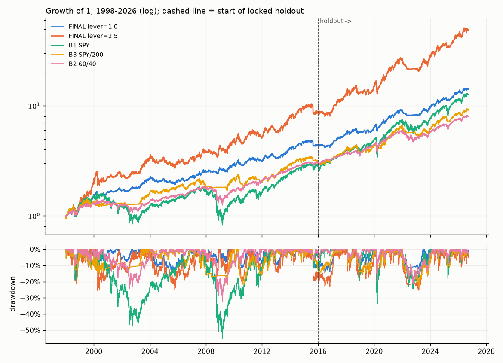
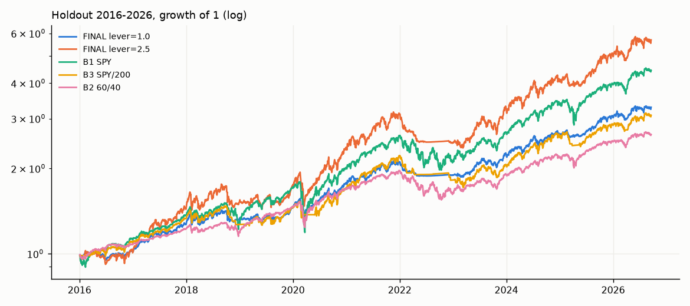

# REPORT.md — rules-based tactical system for a US self-directed IRA

Freeze commit `06a6f79` (RULES.md and `src/system.py` PARAMS). Holdout run once at the next commit by `src/run_holdout.py`, which then wrote `reports/holdout/RAN_ONCE` and refuses to run again. All figures below are read from `reports/holdout/holdout_metrics.csv`, `TRIAL_LEDGER.csv` and the Phase 3 CSVs; nothing is quoted from memory.

## 1. Verdict against the objective

Objective: CAGR at least 15% with MAR at least 1.0 (stretch 1.25). **Not met in any full window.** The best MAR of any configuration over a full window is 0.82 (final system at 1x exposure, holdout 2016-2026), with CAGR 11.8%. The only way to reach 15% CAGR is the 2.5x to 3x exposure multiplier, which gives CAGR 14.6% to 15.6% over 1998-2026 at MAR 0.57 to 0.56. MAR above 1.0 appears only inside single episodes (2007-09 and 2020 at 1x). A negative result on the stated target is the honest deliverable; what the system does deliver is a Sharpe of 0.75 over 28 years with a 15.5% worst drawdown, versus 0.53 and 22.7% for the simple 200-day timing baseline and 0.44 and 55.2% for buy and hold.

## 2. The system (one page in RULES.md)

70% equity core: QQQ sized to a 10% volatility target while above its 200-day average, otherwise IEF if IEF is above its own 200-day average, otherwise cash. 30% momentum rotation: top three of SPY, QQQ, IWM, TLT, GLD by 126-day return, each replaced by cash if it lags cash, rebalanced monthly. 2% rebalance band. One exposure multiplier. Eight free parameters. Base-case execution is at the close of the day after the signal.

## 3. Results

### Full period 1998-01-02 to 2026-09-18

| Config | CAGR | Vol | Sharpe | Sortino | MaxDD | MDD peak→trough (recovery) | Longest underwater (days) | Worst day | Worst month | Worst 12m | MAR | Time in mkt | Avg lev | Turnover | Trades/yr | Consec RT/yr | Corr SPY |
|---|---|---|---|---|---|---|---|---|---|---|---|---|---|---|---|---|---|
| FINAL lever=1.0 | 9.7% | 10.2% | 0.75 | 0.98 | -15.5% | 2004-01-26→2005-10-12 (2006-11-20) | 1028 | -4.0% | -9.4% | -13.4% | 0.63 | 98.5% | 0.73 | 10.3 | 75 | 6.1 | 0.49 |
| FINAL lever=2.5 | 14.6% | 17.9% | 0.73 | 0.96 | -25.6% | 2000-03-09→2000-04-14 (2001-10-31) | 1253 | -8.5% | -15.2% | -21.4% | 0.57 | 98.5% | 1.25 | 14.6 | 132 | 10.3 | 0.50 |
| FINAL lever=3.0 | 15.6% | 19.6% | 0.73 | 0.96 | -27.9% | 2021-11-19→2023-03-10 (2023-12-14) | 1261 | -8.4% | -17.1% | -24.0% | 0.56 | 98.5% | 1.38 | 15.6 | 138 | 10.9 | 0.50 |
| B1 SPY | 9.3% | 19.3% | 0.44 | 0.57 | -55.2% | 2007-10-09→2009-03-09 (2012-08-16) | 2404 | -10.9% | -16.5% | -47.4% | 0.17 | 100.0% | 1.00 | 0.0 | 0 | 0.0 | 1.00 |
| B2 60/40 | 7.5% | 10.9% | 0.52 | 0.69 | -32.2% | 2007-12-10→2009-03-09 (2010-09-28) | 1233 | -5.4% | -10.3% | -27.9% | 0.23 | 99.7% | 1.00 | 0.3 | 24 | 0.0 | 0.97 |
| B3 SPY/200 | 8.1% | 12.0% | 0.53 | 0.60 | -22.7% | 2022-01-03→2023-03-13 (2024-03-01) | 1416 | -5.8% | -8.3% | -17.9% | 0.36 | 75.3% | 0.75 | 6.8 | 7 | 1.0 | 0.62 |
| B4 volSPY | 7.0% | 10.4% | 0.50 | 0.67 | -30.9% | 2000-09-01→2003-03-11 (2006-05-05) | 2068 | -4.2% | -7.2% | -21.2% | 0.23 | 100.0% | 0.71 | 4.6 | 192 | 43.9 | 0.87 |

### Design window 1998-2015

| Config | CAGR | Vol | Sharpe | Sortino | MaxDD | MDD peak→trough (recovery) | Longest underwater (days) | Worst day | Worst month | Worst 12m | MAR | Time in mkt | Avg lev | Turnover | Trades/yr | Consec RT/yr | Corr SPY |
|---|---|---|---|---|---|---|---|---|---|---|---|---|---|---|---|---|---|
| FINAL lever=1.0 | 8.5% | 10.2% | 0.64 | 0.88 | -15.5% | 2004-01-26→2005-10-12 (2006-11-20) | 1028 | -4.0% | -9.4% | -10.1% | 0.55 | 99.9% | 0.75 | 11.6 | 75 | 6.8 | 0.42 |
| FINAL lever=2.5 | 12.8% | 18.2% | 0.64 | 0.87 | -25.6% | 2000-03-09→2000-04-14 (2001-10-31) | 1253 | -8.5% | -15.2% | -15.1% | 0.50 | 99.9% | 1.28 | 16.3 | 134 | 11.5 | 0.43 |
| FINAL lever=3.0 | 13.6% | 19.8% | 0.64 | 0.87 | -27.0% | 2004-01-20→2005-10-12 (2007-07-05) | 1261 | -8.4% | -17.1% | -16.9% | 0.50 | 99.9% | 1.42 | 17.1 | 138 | 12.1 | 0.42 |
| B1 SPY | 6.0% | 20.2% | 0.29 | 0.38 | -55.2% | 2007-10-09→2009-03-09 (2012-08-16) | 2404 | -9.8% | -16.5% | -47.4% | 0.11 | 100.0% | 1.00 | 0.1 | 0 | 0.0 | 1.00 |
| B2 60/40 | 6.4% | 11.2% | 0.41 | 0.57 | -32.2% | 2007-12-10→2009-03-09 (2010-09-28) | 1233 | -5.3% | -10.3% | -27.9% | 0.20 | 99.5% | 1.00 | 0.3 | 24 | 0.0 | 0.97 |
| B3 SPY/200 | 6.3% | 12.0% | 0.39 | 0.45 | -21.8% | 2007-07-19→2009-07-10 (2009-12-22) | 1416 | -5.7% | -8.3% | -16.8% | 0.29 | 70.6% | 0.71 | 7.8 | 8 | 1.3 | 0.59 |
| B4 volSPY | 4.9% | 10.4% | 0.30 | 0.42 | -30.9% | 2000-09-01→2003-03-11 (2006-05-05) | 2068 | -3.9% | -7.2% | -21.2% | 0.16 | 100.0% | 0.68 | 4.7 | 203 | 47.1 | 0.88 |

### Locked holdout 2016-01-04 to 2026-09-18 (one shot)

| Config | CAGR | Vol | Sharpe | Sortino | MaxDD | MDD peak→trough (recovery) | Longest underwater (days) | Worst day | Worst month | Worst 12m | MAR | Time in mkt | Avg lev | Turnover | Trades/yr | Consec RT/yr | Corr SPY |
|---|---|---|---|---|---|---|---|---|---|---|---|---|---|---|---|---|---|
| FINAL lever=1.0 | 11.8% | 10.2% | 0.93 | 1.13 | -14.4% | 2020-02-19→2020-03-18 (2020-07-06) | 598 | -3.7% | -7.2% | -10.6% | 0.82 | 96.1% | 0.70 | 8.0 | 74 | 5.0 | 0.63 |
| FINAL lever=2.5 | 17.7% | 17.3% | 0.90 | 1.10 | -25.3% | 2021-11-19→2023-03-10 (2023-12-13) | 751 | -7.1% | -13.0% | -21.4% | 0.70 | 96.1% | 1.19 | 11.8 | 130 | 8.2 | 0.65 |
| FINAL lever=3.0 | 19.1% | 19.1% | 0.89 | 1.09 | -27.9% | 2021-11-19→2023-03-10 (2023-12-14) | 752 | -7.2% | -14.7% | -24.0% | 0.68 | 96.1% | 1.32 | 12.9 | 140 | 8.9 | 0.64 |
| B1 SPY | 15.0% | 17.7% | 0.75 | 0.91 | -33.7% | 2020-02-19→2020-03-23 (2020-08-10) | 708 | -10.9% | -12.5% | -19.7% | 0.44 | 100.0% | 1.00 | 0.0 | 0 | 0.0 | 1.00 |
| B2 60/40 | 9.5% | 10.5% | 0.71 | 0.88 | -21.2% | 2021-12-27→2022-10-14 (2024-02-23) | 787 | -5.4% | -7.4% | -17.8% | 0.45 | 100.0% | 1.00 | 0.2 | 24 | 0.0 | 0.97 |
| B3 SPY/200 | 11.1% | 11.9% | 0.76 | 0.85 | -22.7% | 2022-01-03→2023-03-13 (2024-03-01) | 787 | -5.8% | -8.3% | -17.9% | 0.49 | 83.3% | 0.83 | 5.1 | 5 | 0.7 | 0.67 |
| B4 volSPY | 10.8% | 10.3% | 0.83 | 1.05 | -12.7% | 2021-11-18→2022-09-30 (2023-06-30) | 588 | -4.2% | -6.3% | -10.3% | 0.85 | 100.0% | 0.76 | 4.3 | 174 | 38.4 | 0.88 |

### 2000-2002 bear market

| Config | CAGR | Vol | Sharpe | Sortino | MaxDD | MDD peak→trough (recovery) | Longest underwater (days) | Worst day | Worst month | Worst 12m | MAR | Time in mkt | Avg lev | Turnover | Trades/yr | Consec RT/yr | Corr SPY |
|---|---|---|---|---|---|---|---|---|---|---|---|---|---|---|---|---|---|
| FINAL lever=1.0 | 5.7% | 9.1% | 0.24 | 0.31 | -11.8% | 2000-03-09→2000-04-14 (2001-02-28) | 355 | -3.5% | -3.9% | -0.6% | 0.48 | 100.0% | 0.74 | 9.9 | 37 | 4.4 | 0.12 |
| FINAL lever=2.5 | 5.7% | 19.2% | 0.19 | 0.24 | -25.6% | 2000-03-09→2000-04-14 (2001-10-31) | 600 | -8.5% | -9.7% | -9.0% | 0.22 | 100.0% | 1.37 | 15.3 | 81 | 10.1 | 0.18 |
| FINAL lever=3.0 | 6.1% | 19.8% | 0.21 | 0.26 | -25.4% | 2000-03-09→2000-04-14 (2001-10-03) | 572 | -8.4% | -9.5% | -7.6% | 0.24 | 100.0% | 1.51 | 16.1 | 68 | 9.4 | 0.16 |
| B1 SPY | -14.6% | 24.2% | -0.68 | -1.13 | -47.5% | 2000-03-24→2002-10-09 (not recovered) | 1009 | -5.7% | -10.5% | -33.5% | -0.31 | 100.0% | 1.00 | 0.0 | 0 | 0.0 | 1.00 |
| B2 60/40 | -4.3% | 13.6% | -0.52 | -0.89 | -24.2% | 2000-09-01→2002-07-23 (not recovered) | 847 | -3.1% | -5.2% | -17.5% | -0.18 | 100.0% | 1.00 | 0.3 | 24 | 0.0 | 0.98 |
| B3 SPY/200 | -2.2% | 11.3% | -0.47 | -0.38 | -13.4% | 2000-03-24→2000-05-23 (not recovered) | 1009 | -5.7% | -6.0% | -8.7% | -0.16 | 27.0% | 0.27 | 9.7 | 10 | 1.7 | 0.47 |
| B4 volSPY | -9.1% | 11.0% | -1.16 | -1.75 | -30.6% | 2000-09-01→2002-10-09 (not recovered) | 847 | -3.1% | -6.0% | -21.2% | -0.30 | 100.0% | 0.48 | 4.9 | 251 | 60.0 | 0.95 |

### 2007-2009 crisis

| Config | CAGR | Vol | Sharpe | Sortino | MaxDD | MDD peak→trough (recovery) | Longest underwater (days) | Worst day | Worst month | Worst 12m | MAR | Time in mkt | Avg lev | Turnover | Trades/yr | Consec RT/yr | Corr SPY |
|---|---|---|---|---|---|---|---|---|---|---|---|---|---|---|---|---|---|
| FINAL lever=1.0 | 9.8% | 10.6% | 0.72 | 1.03 | -8.8% | 2008-12-30→2009-07-07 (2009-08-13) | 261 | -4.0% | -4.0% | -7.6% | 1.11 | 100.0% | 0.77 | 9.4 | 64 | 7.0 | 0.14 |
| FINAL lever=2.5 | 14.4% | 18.1% | 0.71 | 1.02 | -16.1% | 2008-12-30→2009-07-07 (2009-09-09) | 399 | -6.7% | -8.2% | -15.1% | 0.90 | 100.0% | 1.31 | 13.9 | 113 | 9.7 | 0.13 |
| FINAL lever=3.0 | 15.4% | 20.0% | 0.70 | 1.00 | -17.8% | 2008-12-30→2009-07-07 (2009-09-09) | 399 | -7.5% | -9.0% | -16.9% | 0.86 | 100.0% | 1.45 | 14.7 | 122 | 9.3 | 0.14 |
| B1 SPY | -5.7% | 29.9% | -0.12 | -0.16 | -55.2% | 2007-10-09→2009-03-09 (not recovered) | 813 | -9.8% | -16.5% | -47.4% | -0.10 | 100.0% | 1.00 | 0.0 | 0 | 0.0 | 1.00 |
| B2 60/40 | 0.0% | 16.1% | -0.06 | -0.07 | -32.2% | 2007-12-10→2009-03-09 (not recovered) | 751 | -5.3% | -10.3% | -27.9% | 0.00 | 100.0% | 1.00 | 0.4 | 24 | 0.0 | 0.98 |
| B3 SPY/200 | 3.4% | 11.2% | 0.15 | 0.14 | -21.8% | 2007-07-19→2009-07-10 (2009-12-22) | 886 | -3.9% | -7.3% | -16.8% | 0.15 | 50.3% | 0.50 | 7.3 | 7 | 0.7 | 0.35 |
| B4 volSPY | -0.3% | 10.6% | -0.18 | -0.24 | -23.8% | 2007-10-09→2009-03-09 (not recovered) | 813 | -3.9% | -5.1% | -18.5% | -0.01 | 100.0% | 0.53 | 4.8 | 226 | 57.3 | 0.82 |

### 2020

| Config | CAGR | Vol | Sharpe | Sortino | MaxDD | MDD peak→trough (recovery) | Longest underwater (days) | Worst day | Worst month | Worst 12m | MAR | Time in mkt | Avg lev | Turnover | Trades/yr | Consec RT/yr | Corr SPY |
|---|---|---|---|---|---|---|---|---|---|---|---|---|---|---|---|---|---|
| FINAL lever=1.0 | 22.5% | 13.0% | 1.59 | 1.80 | -14.4% | 2020-02-19→2020-03-18 (2020-07-06) | 137 | -3.0% | -3.5% | 20.9% | 1.56 | 100.0% | 0.67 | 6.7 | 72 | 8.0 | 0.65 |
| FINAL lever=2.5 | 38.2% | 23.0% | 1.50 | 1.68 | -24.1% | 2020-02-19→2020-03-18 (2020-07-10) | 141 | -7.1% | -5.8% | 35.1% | 1.58 | 100.0% | 1.14 | 9.6 | 121 | 9.0 | 0.69 |
| FINAL lever=3.0 | 41.0% | 24.6% | 1.50 | 1.67 | -25.9% | 2020-02-19→2020-03-18 (2020-07-20) | 151 | -7.2% | -6.5% | 37.5% | 1.58 | 100.0% | 1.24 | 10.5 | 134 | 9.0 | 0.69 |
| B1 SPY | 18.3% | 33.4% | 0.65 | 0.74 | -33.7% | 2020-02-19→2020-03-23 (2020-08-10) | 172 | -10.9% | -12.5% | 17.2% | 0.54 | 100.0% | 1.00 | 0.0 | 0 | 0.0 | 1.00 |
| B2 60/40 | 16.6% | 17.9% | 0.92 | 1.03 | -18.7% | 2020-02-19→2020-03-23 (2020-06-05) | 106 | -5.4% | -5.9% | 15.8% | 0.89 | 100.0% | 1.00 | 0.4 | 24 | 0.0 | 0.99 |
| B3 SPY/200 | 17.6% | 16.9% | 1.01 | 1.02 | -12.5% | 2020-02-19→2020-02-28 (2020-08-12) | 174 | -5.8% | -7.9% | 16.6% | 1.41 | 76.7% | 0.77 | 6.0 | 6 | 2.0 | 0.51 |
| B4 volSPY | 10.4% | 11.7% | 0.86 | 0.98 | -11.8% | 2020-02-19→2020-03-23 (2020-08-21) | 183 | -3.4% | -4.1% | 9.4% | 0.88 | 100.0% | 0.55 | 4.7 | 222 | 54.8 | 0.81 |

### 2022 stock-and-bond selloff

| Config | CAGR | Vol | Sharpe | Sortino | MaxDD | MDD peak→trough (recovery) | Longest underwater (days) | Worst day | Worst month | Worst 12m | MAR | Time in mkt | Avg lev | Turnover | Trades/yr | Consec RT/yr | Corr SPY |
|---|---|---|---|---|---|---|---|---|---|---|---|---|---|---|---|---|---|
| FINAL lever=1.0 | -9.9% | 4.0% | -2.94 | -2.24 | -10.6% | 2022-01-03→2022-06-14 (not recovered) | 360 | -1.5% | -3.0% | n/a | -0.93 | 57.8% | 0.11 | 3.2 | 22 | 4.0 | 0.37 |
| FINAL lever=2.5 | -20.5% | 8.4% | -2.86 | -2.32 | -21.1% | 2022-01-03→2022-12-28 (not recovered) | 360 | -3.1% | -6.9% | n/a | -0.97 | 57.8% | 0.25 | 7.5 | 30 | 3.0 | 0.39 |
| FINAL lever=3.0 | -23.0% | 9.7% | -2.82 | -2.32 | -23.7% | 2022-01-03→2022-12-28 (not recovered) | 360 | -3.6% | -8.0% | n/a | -0.97 | 57.8% | 0.29 | 8.8 | 31 | 4.0 | 0.40 |
| B1 SPY | -18.2% | 24.2% | -0.77 | -1.24 | -24.5% | 2022-01-03→2022-10-12 (not recovered) | 360 | -4.3% | -9.2% | n/a | -0.74 | 100.0% | 1.00 | 0.0 | 0 | 0.0 | 1.00 |
| B2 60/40 | -16.7% | 15.8% | -1.17 | -1.92 | -20.9% | 2022-01-03→2022-10-14 (not recovered) | 360 | -3.0% | -7.4% | n/a | -0.80 | 100.0% | 1.00 | 0.3 | 24 | 0.0 | 0.97 |
| B3 SPY/200 | -17.5% | 8.2% | -2.50 | -1.58 | -18.0% | 2022-01-03→2022-12-15 (not recovered) | 360 | -2.5% | -5.5% | n/a | -0.97 | 19.5% | 0.20 | 15.1 | 15 | 3.0 | 0.34 |
| B4 volSPY | -9.5% | 10.7% | -1.02 | -1.55 | -12.6% | 2022-01-03→2022-09-30 (not recovered) | 360 | -2.1% | -4.9% | n/a | -0.76 | 100.0% | 0.44 | 4.3 | 252 | 63.3 | 0.98 |

Notes: MAR is CAGR divided by max drawdown. Worst 12 months is n/a for calendar-year slices (needs 252 prior days inside the slice). Time in market counts days with any non-cash position. Avg lev is average gross exposure (sum of weight times fund leverage). Consec RT/yr counts an executed buy followed by an executed sell of the same instrument the next day.

### Annual returns

| Year | FINAL lever=1.0 | FINAL lever=2.5 | FINAL lever=3.0 | B1 SPY | B2 60/40 | B3 SPY/200 | B4 volSPY |
|---|---|---|---|---|---|---|---|
| 1998 | 18.3% | 32.9% | 34.6% | 27.8% | 19.9% | 23.2% | 15.1% |
| 1999 | 30.2% | 60.5% | 62.3% | 20.4% | 9.9% | 10.5% | 13.0% |
| 2000 | 6.1% | 5.2% | 6.1% | -9.8% | -0.3% | -7.5% | -4.0% |
| 2001 | 3.6% | 1.4% | 0.6% | -11.7% | -4.0% | 3.5% | -10.5% |
| 2002 | 7.2% | 10.7% | 11.7% | -21.6% | -8.2% | -2.1% | -12.5% |
| 2003 | 20.6% | 34.2% | 36.9% | 28.2% | 17.7% | 27.8% | 18.5% |
| 2004 | -0.5% | 0.8% | 1.5% | 10.7% | 8.1% | 6.1% | 7.7% |
| 2005 | -6.9% | -13.5% | -15.7% | 4.8% | 4.1% | 5.0% | 2.6% |
| 2006 | 10.1% | 10.7% | 10.9% | 15.9% | 10.4% | 8.2% | 16.1% |
| 2007 | 14.4% | 19.2% | 20.2% | 5.1% | 7.4% | -6.9% | 4.2% |
| 2008 | 5.9% | 10.5% | 11.5% | -36.8% | -17.7% | -0.9% | -13.7% |
| 2009 | 9.3% | 13.6% | 14.6% | 26.4% | 13.2% | 19.7% | 10.2% |
| 2010 | 6.6% | 9.1% | 10.5% | 15.1% | 13.5% | -3.0% | 13.1% |
| 2011 | -0.9% | -4.3% | -4.7% | 1.9% | 7.9% | -4.6% | -0.3% |
| 2012 | 6.4% | 12.9% | 14.2% | 16.0% | 11.3% | 13.0% | 10.3% |
| 2013 | 25.2% | 41.6% | 47.5% | 32.3% | 15.6% | 32.3% | 24.1% |
| 2014 | 11.9% | 18.3% | 20.9% | 13.5% | 11.9% | 9.7% | 7.2% |
| 2015 | -6.3% | -9.6% | -10.6% | 1.2% | 1.7% | -9.1% | -3.8% |
| 2016 | 1.3% | 0.9% | -0.1% | 12.0% | 7.7% | 9.2% | 7.1% |
| 2017 | 25.0% | 42.3% | 48.4% | 21.7% | 13.5% | 21.7% | 21.7% |
| 2018 | 5.0% | 6.3% | 6.3% | -4.6% | -2.0% | -4.6% | -1.7% |
| 2019 | 9.3% | 12.6% | 14.3% | 31.2% | 21.8% | 14.8% | 18.4% |
| 2020 | 22.6% | 38.3% | 41.2% | 18.3% | 16.6% | 17.7% | 10.4% |
| 2021 | 18.0% | 30.5% | 33.5% | 28.7% | 15.1% | 28.7% | 18.7% |
| 2022 | -9.8% | -20.4% | -22.9% | -18.2% | -16.6% | -17.4% | -9.5% |
| 2023 | 19.0% | 33.0% | 37.3% | 26.2% | 16.8% | 13.2% | 18.3% |
| 2024 | 16.0% | 23.1% | 24.8% | 24.9% | 14.2% | 24.9% | 18.8% |
| 2025 | 15.5% | 22.8% | 24.8% | 17.7% | 13.9% | 10.2% | 10.1% |
| 2026 | 8.8% | 14.5% | 15.5% | 12.6% | 6.2% | 8.6% | 7.7% |

## 4. The frontier and how much of it is leverage

Only the exposure multiplier changes between rows (design window, 1x costs):

| Multiplier | CAGR | Vol | Sharpe | MaxDD | MAR | Trades/yr | Avg lev |
|---|---|---|---|---|---|---|---|
| 1.0 | 8.5% | 10.2% | 0.64 | -15.5% | 0.55 | 75 | 0.75 |
| 1.25 | 9.7% | 12.1% | 0.65 | -18.1% | 0.54 | 81 | 0.87 |
| 1.5 | 11.0% | 13.8% | 0.67 | -18.8% | 0.58 | 100 | 0.95 |
| 1.75 | 11.8% | 15.1% | 0.67 | -20.6% | 0.57 | 109 | 1.04 |
| 2.0 | 12.1% | 16.3% | 0.65 | -23.0% | 0.53 | 117 | 1.13 |
| 2.5 | 12.8% | 18.2% | 0.64 | -25.6% | 0.50 | 134 | 1.28 |
| 3.0 | 13.6% | 19.8% | 0.64 | -27.0% | 0.50 | 138 | 1.42 |

At the three drawdown tolerances: **15%** is the 1.0x row (design MaxDD 15.5%, full-period -15.5%, holdout -14.4%); **25%** is the 2.5x row (design 25.6%, full -25.6%, holdout -25.3%); **35%** is not reachable, because with weights capped at 100% and 3x funds the multiplier tops out at 3.0 (design MaxDD 27.0%, full -27.9%, holdout -27.9%). Sharpe is flat across the frontier (0.64 to 0.67 in design, 0.75 to 0.73 full period) while MAR falls from 0.63 to 0.56: every point of CAGR above the 1x row is leverage, and leverage buys CAGR at a worse drawdown ratio because of daily-rebalance volatility drag and the leveraged funds' financing cost and spreads. The 1x row holds no leveraged funds at all (exposure per underlying never exceeds 1), so the leveraged-fund simulation caveats do not apply to it; the ±1%/yr simulated-segment drag test moves the 2.5x row's design Sharpe from 0.64 to 0.63.

## 5. Robustness

Design window (from the ledger, trials 248-255 and 316-317): one extra day of delay Sharpe 0.62 (base 0.64), same-close 0.60, zero costs 0.68, 3x costs 0.58 with MaxDD 17.2%; removing 1998-2002, 2003-2007, 2008-2009 or 2010-2015 leaves Sharpe at 0.58, 0.72, 0.64, 0.63 against the 200-day baseline's 0.52, 0.38, 0.35, 0.33 on the same reduced windows.

Holdout sensitivities (trials in phase P4): at 1x, lag 3 gives Sharpe 0.98 and MAR 1.09 (better than base because the delayed exit missed less), lag 1 gives 0.94, zero costs 0.95, 3x costs 0.88; at 2.5x the same four are 0.98, 0.94, 0.92, 0.84.

Neighbourhood: the H5 rotation family is the only one whose whole grid clears the neighbourhood rule; the QQQ trend-times-vol core clears it only with the inverse bear side excluded (median Sharpe 0.40 versus baseline 0.39, weak). The final blend's own parameter neighbourhood was not re-gridded after assembly, which is a limitation; the frontier table shows the multiplier dimension is smooth.

## 6. Multiple-testing haircut

Distinct design-phase trials: 228 (ledger rows 498; superseded and duplicate rows are annotated, never deleted). Cross-trial Sharpe dispersion 0.19. Expected best Sharpe of 228 zero-edge trials with that dispersion: 0.54 annualised. Probability that the true Sharpe exceeds that bar (deflated Sharpe, skew and kurtosis adjusted): design 0.66, holdout 0.89, full 0.86. The design-window figure says the in-sample Sharpe of 0.64 is only modestly above what data mining alone would produce; the holdout, which was untouched by selection, is the evidence that matters and it is favourable but from one 10.7-year sample.

## 7. What failed and why

- **Inverse and leveraged-inverse funds as the bear side (client request).** Every cell was worse than cash, most with negative CAGR (H1 -2x cells lost 4 to 13%/yr). Trend gates flip too often in ranges, and a short position through a -2x fund pays the whipsaw twice plus financing. Dropped.
- **Buy-the-dip with 3x (the Whale archetype, H4).** Highest CAGR of any family on QQQ (16 to 19%/yr) but 54 to 78% drawdowns, MAR 0.25 to 0.30. Leverage at the dip inside a trend does not distinguish a dip from the start of a bear market.
- **Vol targeting alone (H2, B4).** Cuts drawdowns but sits at 30% in 2002 and 2008; needs the trend gate.
- **Trend filter on SPY (H1).** Only the 200 and 250-day settings beat buy and hold; the 100 and 150-day settings lose to it. QQQ versions are stronger but with 36 to 50% drawdowns.
- **Short-term reversal (H10).** MAR up to 0.64 but CAGR 4% and 5 to 11 next-day round trips per year; not a core, and not blended because the blend was pre-registered as H3 plus H5.
- **VIX regime overlay (H8).** Neutral to slightly negative on the core.
- **Drawdown-control overlay (H7).** +0.02 MAR, -0.5% CAGR, one more parameter. Left out.
- **Multi-asset trend-gated risk parity (H6).** Passed the edge test (Sharpe 0.60, MAR 0.41) but 535 trades a year and 145 next-day round trips before any band, and its median cell fails once inverse cells are included.

## 8. The three things most likely to break this live

1. **A slow, grinding bear in QQQ with bonds falling too (a repeat of 2022).** The core's trend gate whipsaws and its fallback is IEF, which lost in 2022. The system returned -9.8% that year at 1x and -20% at 2.5x; its holdout drawdown came from exactly this. A higher-rate regime makes the IEF fallback a liability rather than a hedge.
2. **Leveraged-fund mechanics at 2.5x and above.** The 25% frontier point needs TQQQ, UPRO, TMF, UGL and UST. UGL, UST and UBT fail the liquidity screen for a $1M account (see below), the simulated pre-inception history carries about ±1%/yr uncertainty, and financing spreads on these funds have moved by more than 1%/yr between halves of their live history. The 1x version has none of this exposure.
3. **Data and execution drift.** Signals were built on dividend-adjusted closes from one vendor; a live feed with different adjustment or a late close print changes the 200-day gate on marginal days. The base case already assumes a full day between signal and fill; same-close execution is not required but a missed day is roughly neutral per the lag-3 test. Turnover concentrates at trend flips, which is when spreads are widest.

## 9. Settlement and liquidity

At 1x the system trades about 75 times a year with 6.1 next-day round trips a year (full period), because the 2% band removes the daily vol-target dribble. **Limited margin is not needed**: keep the cash sleeve in a money-market fund that settles same-day, and on the rare day a position is cut the day after it was added, size the sell from settled shares only. At 2.5x the counts are 132 and 10.3.

Liquidity, $1M account versus 1% of median daily dollar volume over the last three years:

| ETF | Median daily $ volume (M) | Account as % of it | Flag |
|---|---|---|---|
| SPY | 36072 | 0.00% | ok |
| QQQ | 21721 | 0.00% | ok |
| IWM | 6737 | 0.01% | ok |
| TLT | 2950 | 0.03% | ok |
| IEF | 671 | 0.15% | ok |
| GLD | 2347 | 0.04% | ok |
| BIL | 673 | 0.15% | ok |
| TQQQ | 4300 | 0.02% | ok |
| UPRO | 367 | 0.27% | ok |
| TMF | 253 | 0.40% | ok |
| UGL | 32 | 3.08% | FLAG |
| UST | 0 | 424.13% | FLAG |
| SSO | 199 | 0.50% | ok |
| QLD | 309 | 0.32% | ok |
| UBT | 1 | 69.16% | FLAG |

UGL, UST and UBT are flagged. They are used only above 1x exposure (UST for the IEF fallback, UGL for the gold rotation slot). A practical fix is to leave those two sleeves unlevered when running above 1x; that variant was not backtested and would slightly lower the levered rows' CAGR.

## 10. Deviations from PREREG.md, disclosed

- Overlays H7 to H11 were run on the P1-passing H3 cell (QQQ/200/10%/b0) as well as the grid-median cell, and the final core uses the H9 IEF-instead-of-cash overlay inside it. The blend therefore contains a component chosen as a best cell, not a median cell.
- A 2% rebalance band was added after seeing that the unbanded blend traded 754 times a year; it counts as one of the eight parameters. It changed CAGR by 0.0% and MAR by 0.001 in the design window.
- Rotation count k=3 was kept although k=2 had higher MAR in one comparison (trial 240), to avoid a second best-cell selection.
- Ledger hygiene: 5 baseline rows superseded by a metric fix, 24 H1 rows superseded by a sign bug fix, and 168 exact duplicate rows created by a module import side effect (twice). All retained and annotated; the distinct design-phase trial count used for the haircut is 228.
- The client changed scope after PREREG v1 (inverse funds allowed, objective restated); PREREG v2 was committed before the first trial.

## 11. Data caveats

Primary daily source is FMP dividend-adjusted closes, not the Norgate export (which could not be loaded through this environment's 6 MB connector limit; see DATA_AUDIT.md). FMP agrees with Norgate total-return closes to within 2 to 6 bp/yr on the two ETFs that could be cross-checked. Pre-inception segments are proxies (PROXY_VALIDATION.md): the 1x system's exposure to those is QQQ before 1999-03 (14 months of NDX plus carry), IWM before 2000-05, TLT/IEF before 2002-07 (par-bond proxies; IEF's carries +0.9%/yr drift), GLD before 2004-11. The 2000-02 episode is therefore the least reliable of the four.

## 11a. Post-holdout history extension to 1991 (exploratory, not pre-registered)

After the holdout run the client asked whether index data (NDX, GSPC, RUT, GCUSD) could push the test further back. A second proxy panel starting 1990-01-02 was built with the same code and the same calibrations (`python3 src/proxies.py --ext`, output `data/proxies_ext/`, frozen panel untouched and reproduced bit-for-bit). Additional proxy assumptions in the extension only: the trading calendar before SPY's first print (1993-01-29) is the S&P 500 index calendar; the 20-year CMT yield is not published before 1993-10 and is filled with the 30-year yield plus the mean 30y minus 20y spread of 1993-10 to 1996-10 (-11 bp, 950 days filled); everything before 1993-01 is entirely proxy (no live ETF anywhere in the book), and before 1999-03/2002-07/2004-11 the QQQ/bond/gold legs are proxies as in the main panel. Frozen rules, band 0.02, lag 2, costs x1. Rows are logged as phase P5 and are excluded from the deflated-Sharpe trial count. Script: `src/run_extension.py`; outputs in `reports/extension/` (`summary.md`, `extension_metrics.csv`, `annual_returns.csv`, `equity_extension.png`).

| 1991-01-04 to 2026-09-18 | CAGR | Vol | Sharpe | MaxDD | MAR | Avg lev |
|---|---|---|---|---|---|---|
| FINAL 1x | 10.3% | 10.2% | 0.75 | -15.5% | 0.66 | 0.71 |
| FINAL 2.5x | 15.6% | 17.9% | 0.75 | -25.6% | 0.61 | 1.22 |
| SPY buy-and-hold | 11.3% | 18.2% | 0.53 | -55.2% | 0.21 | 1.00 |

| New segment 1991-01-04 to 1997-12-31 | CAGR | Vol | Sharpe | MaxDD | MAR |
|---|---|---|---|---|---|
| FINAL 1x | 12.3% | 10.3% | 0.73 | -10.4% | 1.18 |
| FINAL 2.5x | 19.4% | 17.8% | 0.82 | -16.9% | 1.15 |
| SPY buy-and-hold | 20.0% | 12.7% | 1.13 | -11.2% | 1.79 |

What the new seven years say. The system behaves in 1991-1997 the way it behaves later: roughly SPY's return at half to two thirds of SPY's drawdown at 1x, and the 2.5x version adds return one-for-one with drawdown. It does not beat buy-and-hold in a low-volatility bull market (1995-1997 SPY compounded at 31% with an 11% drawdown; the 1x system did 19% with a 10% drawdown). 1994, the bond bear, is a loss year for the system (-1.5% at 1x, -6.6% at 2.5x, SPY +0.4%): the rotation sleeve was long TLT/IEF into the rate shock and the core sat in cash for much of the year. The 1991-1993 all-proxy segment shows MAR above 1.5 at both leverage levels, but that is three years of proxy data in a bull market and should carry no weight. Adding seven years lifts the full-window MAR from 0.63 to 0.66 (1x) and 0.57 to 0.61 (2.5x); the objective of CAGR 15% with MAR 1.0 is still not met on any window longer than a decade. The 1998+ slice of the extension reproduces the holdout run (identical MaxDD; CAGR within 0.07% because positions are already held on 1998-01-02 instead of starting from cash).

Data note found during this step: re-harvesting FMP tool results had overwritten eight SPY rows (2024-03-11 to 2024-03-20) with unadjusted-endpoint rows lacking `adjClose`. The merge in `src/fmp_ingest.py` and `src/transcript_harvest.py` now merges field-by-field per date (last non-null wins) and the rows were restored from the saved tool results before any panel was rebuilt; the frozen panel was verified to be reproduced exactly afterwards, so no reported figure changed.

## 12. Files

`DATA_AUDIT.md`, `PROXY_VALIDATION.md` (+ `reports/proxies/`), `PREREG.md`, `TRIAL_LEDGER.csv`, `RULES.md`, `daily_signal.py`, `src/` (engine, strategies, system, trials, run_phase3*.py, run_holdout.py), `tests/test_engine.py` (9 passing), `reports/phase3/summary.md`, `reports/holdout/`, `src/run_extension.py` and `reports/extension/` (post-holdout 1991 extension, section 11a).

