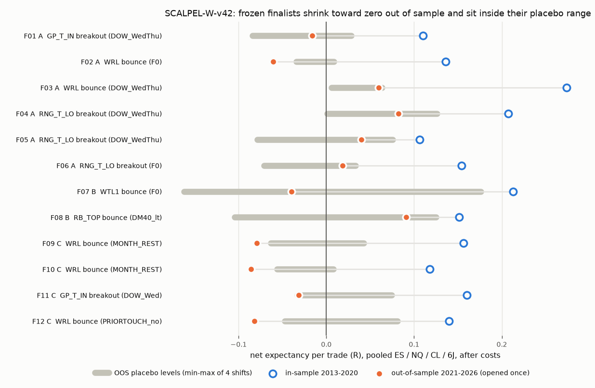

# REPORT - SCALPEL-W-v42

Status tags: **[NEW]** = computed in this study; **[ARCHIVE]** = quoted from earlier work, not
re-verified; **[RECONSTRUCTION]** = this study's rebuild of an archive idea or of the native levels.
Every table below is generated by `src/build_report.py` from files in `outputs/`.

## 1. Verdict

**No strategy built on the weekly v42 / TrueALGO levels passed validation. [NEW]** Twelve rules were
frozen from 2013-2020 data and tested once on 2021-2026. None passed every gate. 5 of them kept a
small positive out-of-sample expectancy (+0.02 to +0.09 R per trade after costs) and
7 went negative. Every positive result sits inside the range the same rule produced on
placebo levels shifted 0.15-0.30 sigma.

The evidence points one way. On these four tickers the levels carry no information beyond their
distance from the weekly open:

* **Step 1 [NEW].** No level rejects price more often than arbitrary lines at nearby distances
  from WO. Pooled over tickers, 16 of 18 levels have a 95% interval on the excess that spans zero.
  The exceptions are *weaker* than their placebos: GB_BOT and RNG_B_HI at 0.25 sigma, RNG_T_LO and
  RNG_B_HI at 0.5 sigma. Arbitrary lines within 1.3 sigma of WO, where most touches happen, are
  rejected 36-55% of the time.
* **The whole search, run on placebo levels [NEW].** The identical 229,068-config grid run on
  levels shifted by -0.30 / -0.15 / +0.15 / +0.30 sigma gives
  498 / 937 / 990 / 756
  screen-passing configs. The real levels give 725. The real levels' top-10
  expectancy (0.450 R) is beaten by three of the four placebo sets.
* **What the in-sample winners really were.** 723 of the 725 F0 passers are long trades:
  dip-buys at lower levels or breakouts through upper levels. Buying ES and NQ during 2013-2020
  paid +0.12 and +0.14 sigma per week on average (t = 2.7 and 3.7). That is drift in the market,
  not something the indicator found. Out of sample the finalists fell to -0.09 to
  +0.09 R per trade.

The answer to the mission question: **on this evidence, weeks of hand-extracting native levels
are not worth it.** The prompt states that v42 reproduces the native levels exactly on these
tickers, and this study's engine matches the v42 export to 1e-12 (Section 2). The native levels
would therefore behave the same way. Each level is a fixed percentage of WO; the static per-asset
vol and multipliers set the percentages. Any line at a similar distance does the same job.

## 2. Data, level engine, canary [NEW]

* Four TradingView 4h exports: ES, NQ, CL, 6J. Timestamps carry their own offset (UTC-9 / UTC-8,
  America/Anchorage). They are converted exactly, and bars start at 18, 22, 02, 06, 10, 14 ET.
* A week runs from Sunday 18:00 ET; WO is the open of its first 4h bar. Weeks run 2013-01-28
  (6J 2016-10-17) to 2026-09-21. In-sample (IS) is up to 2020-12-28: 414 weeks each for ES / NQ /
  CL and 220 for 6J. Out-of-sample (OOS) is 299 weeks per ticker. The final week is incomplete:
  its 3 trades are marked at the latest close.
* Levels come from the pine WEEKLY engine: static vol / bias / SD multipliers, with GP and range
  boxes. ATR(14) is Wilder's, taken on CME trading-day bars as of the last day before the week.
* Canary:

```
# SCALPEL-W-v42 canary report

ES WO      ref    7722.00  got    7722.0000  err 0.0000  ok
ES GB_TOP  ref    8070.75  got    8070.7496  err 0.0004  ok
ES GB_BOT  ref    7912.99  got    7912.9910  err 0.0010  ok
ES RB_TOP  ref    7515.92  got    7515.9203  err 0.0003  ok
ES RB_BOT  ref    7370.84  got    7370.8402  err 0.0002  ok
ES _sigma  ref     198.54  got     198.5354  err 0.0046  ok
GC WO      ref    4413.00  got    4413.0000  err 0.0000  ok
GC GB_TOP  ref    4666.18  got    4666.1809  err 0.0009  ok
GC GB_BOT  ref    4575.50  got    4575.5038  err 0.0038  ok
GC RB_TOP  ref    4299.14  got    4299.1368  err 0.0032  ok
GC RB_BOT  ref    4212.94  got    4212.9423  err 0.0023  ok

ES export check: 717 weeks; level math from exported WO, worst abs error across 18 level columns = 9.09e-13 pt
ES export WO == first 4h open of Sunday-18:00 bucket in 711/717 weeks; differences: 2012-12-31, 2015-07-06, 2018-05-28, 2020-07-06, 2026-06-22, 2026-07-06
(the differing weeks are the partial first week and TradingView holiday-week boundary quirks; this study uses the Sunday-18:00 bucket as the prompt specifies)

CANARY PASS
```

* The four levels NQ, CL and 6J use are computed from the pine math; those exports had no level
  columns to check against. ES matches the export on all 18 level columns in 717 weeks.

## 3. Execution model [NEW]

* Micros: MES, MNQ, MCL, MJY. $4.50 commission per contract round turn. One tick of slippage
  on every entry, stop exit and time exit; limit targets get none.
* Size is 0.5% of a $100,000 account ($500) divided by the *planned* stop distance, rounded down.
  The trade is skipped if one micro exceeds $500. Out of sample this skips many NQ trades with
  1-ATR stops, because one MNQ then risks more than $500.
* A limit fills only if price trades one tick through. When stop and target fall in the same 4h
  bar, the stop fills. A target inside the fill bar of a resting limit counts only if the bar
  closes beyond it. A stop gapped through fills at the open. Everything is flat at the close of
  the week's last 4h bar, with one position per ticker.
* A bug was found and fixed before any validation. The first kernel sized trades on the actual
  fill. A resting limit that filled on a gap next to its stop then got a one-point risk, which
  created 400R trades. Sizing now uses the order price (or the signal bar's close for next-open
  entries), which is what a trader knows when sending a bracket order. F0 and every round were
  re-run. The pre-fix round-1 summary is kept at `outputs/prefix_sizing_bug_round1_summary.csv`,
  and the pre-fix configs are counted in N.

## 4. Step 1 - level strength map, excess over placebo (IS, pooled) [NEW]

A first touch is the first 4h bar that trades through the level. P(rej X) is the chance that
price comes back X sigma toward WO before extending X sigma further. Ambiguous bars count against
the level. The placebo is the mean of the same measure for lines at the level's distance +-0.15
and +-0.30 sigma; placebos that would cross WO are dropped. The 95% intervals come from a 2,000x
paired week bootstrap. Per-ticker rows are in `outputs/step1_level_strength.csv`, and the null
curve (P(reject) against distance for arbitrary lines) is in `outputs/step1_null_curve.csv`.

| level | dist (sigma) | touches | P(rej 0.25) | placebo | excess [95% CI] | P(rej 0.5) excess [95% CI] | MFE6 - MAE6 excess | P(close thru) excess | per-ticker excess 0.25 (ES / NQ / CL / 6J) |
|---|---|---|---|---|---|---|---|---|---|
| GB_TOP | 1.64 | 76 | 0.438 | 0.434 | +0.004 [-0.11, +0.12] | +0.006 [-0.10, +0.12] | +0.018 | +0.022 | -0.02 / -0.14 / +0.08 / -0.22 |
| WTH2 | 1.50 | 91 | 0.470 | 0.424 | +0.045 [-0.08, +0.17] | -0.018 [-0.14, +0.09] | +0.029 | +0.039 | +0.04 / -0.23 / +0.13 / +0.03 |
| WTH1 | 1.13 | 182 | 0.416 | 0.439 | -0.024 [-0.11, +0.06] | +0.033 [-0.03, +0.10] | +0.001 | -0.002 | -0.03 / +0.09 / -0.05 / -0.23 |
| GB_BOT | 0.97 | 239 | 0.342 | 0.438 | -0.096 [-0.16, -0.02] | -0.050 [-0.12, +0.02] | -0.072 | +0.014 | -0.14 / -0.16 / -0.08 / +0.10 |
| RNG_T_HI | 0.61 | 469 | 0.467 | 0.417 | +0.050 [-0.00, +0.10] | +0.017 [-0.03, +0.06] | +0.012 | +0.005 | +0.08 / +0.03 / +0.06 / +0.01 |
| WRH | 0.54 | 559 | 0.453 | 0.428 | +0.025 [-0.02, +0.07] | +0.015 [-0.03, +0.06] | +0.007 | -0.017 | +0.06 / +0.05 / +0.02 / -0.09 |
| RNG_T_LO | 0.46 | 644 | 0.437 | 0.461 | -0.023 [-0.07, +0.02] | -0.053 [-0.09, -0.02] | -0.024 | +0.002 | -0.02 / -0.02 / +0.00 / -0.10 |
| GP_T_IN | 0.27 | 947 | 0.459 | 0.453 | +0.006 [-0.03, +0.04] | +0.023 [-0.01, +0.06] | +0.006 | -0.002 | -0.00 / -0.01 / +0.01 / +0.05 |
| GP_T_OUT | 0.21 | 1056 | 0.471 | 0.461 | +0.010 [-0.03, +0.05] | +0.006 [-0.03, +0.04] | -0.029 | +0.004 | +0.02 / -0.03 / +0.03 / +0.09 |
| GP_B_OUT | 0.26 | 938 | 0.494 | 0.475 | +0.018 [-0.02, +0.06] | -0.002 [-0.04, +0.03] | +0.017 | +0.003 | +0.08 / -0.01 / +0.02 / -0.08 |
| GP_B_IN | 0.33 | 807 | 0.479 | 0.485 | -0.006 [-0.05, +0.03] | -0.033 [-0.07, +0.01] | -0.020 | +0.006 | +0.04 / +0.01 / -0.02 / -0.06 |
| RNG_B_HI | 0.48 | 602 | 0.429 | 0.485 | -0.056 [-0.10, -0.01] | -0.045 [-0.08, -0.01] | -0.025 | +0.006 | -0.12 / -0.03 / -0.04 / -0.05 |
| WRL | 0.56 | 515 | 0.476 | 0.481 | -0.005 [-0.05, +0.04] | -0.013 [-0.05, +0.03] | -0.008 | -0.001 | -0.10 / +0.02 / +0.03 / +0.04 |
| RNG_B_LO | 0.63 | 446 | 0.465 | 0.468 | -0.003 [-0.05, +0.04] | +0.005 [-0.04, +0.04] | +0.009 | +0.007 | +0.03 / -0.05 / -0.03 / +0.17 |
| RB_TOP | 1.03 | 224 | 0.502 | 0.490 | +0.012 [-0.06, +0.08] | +0.026 [-0.03, +0.08] | +0.019 | -0.020 | -0.07 / +0.03 / +0.08 / -0.19 |
| WTL1 | 1.18 | 165 | 0.480 | 0.487 | -0.006 [-0.09, +0.07] | +0.062 [-0.00, +0.12] | +0.052 | -0.031 | +0.08 / +0.07 / -0.16 / -0.02 |
| WTL2 | 1.64 | 63 | 0.361 | 0.432 | -0.071 [-0.22, +0.06] | -0.056 [-0.18, +0.05] | -0.077 | +0.060 | -0.15 / -0.25 / +0.09 / +0.43 |
| RB_BOT | 1.72 | 59 | 0.389 | 0.430 | -0.041 [-0.18, +0.09] | -0.081 [-0.20, +0.04] | -0.024 | +0.050 | -0.08 / -0.23 / +0.09 / +0.42 |

Ranked by excess over placebo, no level stands out. The largest positive excess (RNG_T_HI, +0.05
at 0.25 sigma) has an interval touching zero. With 36 pooled tests, about two intervals would
clear zero by chance. Four do, and all four are negative: those levels are rejected *less* often
than nearby arbitrary lines.

## 5. Step 2 / 2B - strategy search [NEW]

**F0 pierce grid.** 18 levels x {bounce, breakout} x {ATR, sigma} units x 7 pierce depths x 5
entry styles (resting limit / stop, reclaim, reclaim within 1 / 2 / 3 bars) x max pierce
{0.5, 1.0, 1.5} x 7 stops x 8 targets. That is 4,248 entry cells and 229,068 configs, each run
on 4 tickers plus a pooled scope, all in-sample. Full rows are in `results_all_F0.csv.gz`. PF and
expectancy heatmaps for every level / side / unit are in `outputs/heatmaps/`. The screen
(`src/screen.py`) requires n >= 100 pooled, PF >= 1.3, positive net expectancy, breadth across
tickers, and the plateau rule: every +-1-step neighbour positive with median neighbour PF >= 1.3.

**Whole-search placebo and robustness grids.**

| level set | configs with n >= 100 | share net positive | pass n/PF | + breadth | + plateau (screen pass) | top-10 mean expR | top-100 mean expR |
|---|---|---|---|---|---|---|---|
| REAL | 78,518 | 0.210 | 1692 | 1472 | 725 | 0.450 | 0.290 |
| shift-0.30 | 69,500 | 0.235 | 1413 | 1182 | 498 | 0.483 | 0.263 |
| shift-0.15 | 87,490 | 0.250 | 2152 | 1985 | 937 | 0.550 | 0.337 |
| shift+0.15 | 65,581 | 0.213 | 1767 | 1667 | 990 | 0.507 | 0.343 |
| shift+0.30 | 54,066 | 0.242 | 1446 | 1316 | 756 | 0.414 | 0.280 |
| scale0.95 | 81,332 | 0.212 | 1630 | 1483 | 608 | 0.422 | 0.278 |
| scale1.05 | 75,614 | 0.225 | 1920 | 1686 | 864 | 0.425 | 0.343 |
| slip2 | 78,517 | 0.167 | 1126 | 967 | 423 | 0.380 | 0.253 |

**EXPAND rounds.** There were 39 filter variants in 3 rounds. Each is the full F0 grid
under a filter, run on the real levels and on the 4 placebo shifts. A family passes only if its
real-level search beats at least 3 of its 4 placebo searches on both the number of screen passers
and top-10 expectancy. That test is weak: under the null, a real search lands in the top two of
five on one metric 40% of the time, and requiring both metrics lowers that only somewhat.

| round | variant | real passers | placebo passers (mean / max) | real top-10 expR | placebo top-10 (mean / max) | beats placebo (count / top-10) | family screen |
|---|---|---|---|---|---|---|---|
| round1 | TREND10_with | 658 | 554 / 778 | 0.289 | 0.327 / 0.444 | 3/4, 1/4 | fail (b) |
| round1 | TREND10_counter | 906 | 1376 / 1502 | 0.703 | 0.572 / 0.681 | 0/4, 4/4 | fail (b) |
| round1 | DM40_lt | 247 | 372 / 664 | 0.313 | 0.373 / 0.438 | 1/4, 0/4 | fail (b) |
| round1 | DM40_ge | 2013 | 1650 / 2157 | 0.459 | 0.462 / 0.516 | 3/4, 2/4 | fail (b) |
| round1 | RTH | 1083 | 1837 / 2421 | 0.420 | 0.427 / 0.446 | 0/4, 1/4 | fail (b) |
| round1 | ON | 175 | 226 / 292 | 0.389 | 0.387 / 0.408 | 0/4, 2/4 | fail (b) |
| round1 | DOW_MonTue | 513 | 553 / 764 | 0.482 | 0.443 / 0.498 | 2/4, 3/4 | fail (b) |
| round1 | DOW_WedThu | 1192 | 931 / 1208 | 0.513 | 0.472 / 0.487 | 3/4, 4/4 | PASS |
| round1 | DOW_Fri | 0 | 0 / 1 | 0.087 | 0.094 / 0.122 | 0/4, 2/4 | fail (a) |
| round1 | VOL_low | 22 | 63 / 185 | 0.182 | 0.194 / 0.291 | 2/4, 2/4 | fail (b) |
| round1 | VOL_high | 3144 | 3504 / 4445 | 0.615 | 0.579 / 0.625 | 1/4, 3/4 | fail (b) |
| round1 | GAP_against | 4 | 30 / 90 | 0.651 | 0.393 / 0.627 | 2/4, 3/4 | fail (b) |
| round1 | GAP_with | 0 | 0 / 0 | 0.120 | 0.190 / 0.304 | 0/4, 1/4 | fail (a) |
| round1 | WO_crossed_first | 1503 | 1785 / 2167 | 0.429 | 0.438 / 0.461 | 1/4, 2/4 | fail (b) |
| round1 | TOUCH2 | 667 | 854 / 1330 | 0.398 | 0.461 / 0.486 | 2/4, 1/4 | fail (b) |
| round1 | MCONF | 257 | 918 / 1674 | 0.334 | 0.387 / 0.456 | 1/4, 1/4 | fail (b) |
| round1 | MNONE | 1513 | 1383 / 1977 | 0.463 | 0.498 / 0.553 | 2/4, 1/4 | fail (b) |
| round1 | RETEST | 307 | 395 / 626 | 0.487 | 0.491 / 0.643 | 1/4, 2/4 | fail (b) |
| round2 | HOLD | 503 | 484 / 577 | 0.638 | 0.620 / 0.661 | 1/4, 2/4 | fail (b) |
| round2 | FIRSTBAR_with | 1265 | 1585 / 1840 | 0.607 | 0.461 / 0.513 | 1/4, 4/4 | fail (b) |
| round2 | FIRSTBAR_against | 297 | 878 / 1564 | 0.353 | 0.436 / 0.543 | 1/4, 1/4 | fail (b) |
| round2 | PRIORBOX_with | 3 | 52 / 117 | 0.218 | 0.222 / 0.499 | 2/4, 1/4 | fail (b) |
| round2 | PRIORBOX_against | 0 | 0 / 0 | 0.057 | 0.001 / 0.028 | 0/4, 3/4 | fail (a) |
| round2 | PRIORBOX_in | 1316 | 1820 / 2137 | 0.554 | 0.496 / 0.620 | 0/4, 3/4 | fail (b) |
| round2 | EARLY_WEEK | 795 | 788 / 1039 | 0.648 | 0.636 / 0.721 | 1/4, 3/4 | fail (b) |
| round2 | LATE_WEEK | 356 | 465 / 620 | 0.349 | 0.336 / 0.476 | 1/4, 3/4 | fail (b) |
| round2 | PWHL_CONF | 91 | 592 / 1196 | 0.287 | 0.382 / 0.494 | 1/4, 1/4 | fail (b) |
| round2 | PWHL_NONE | 775 | 1074 / 1323 | 0.452 | 0.434 / 0.488 | 1/4, 3/4 | fail (b) |
| round2 | MONTH_FIRSTWEEK | 644 | 679 / 1149 | 0.578 | 0.487 / 0.623 | 2/4, 3/4 | fail (b) |
| round2 | MONTH_REST | 470 | 641 / 730 | 0.473 | 0.477 / 0.592 | 0/4, 3/4 | fail (b) |
| round3 | DOW_Wed | 685 | 583 / 847 | 0.485 | 0.502 / 0.593 | 2/4, 2/4 | fail (b) |
| round3 | DOW_Thu | 1 | 8 / 22 | 0.174 | 0.179 / 0.205 | 0/4, 2/4 | fail (b) |
| round3 | DOW_TueWedThu | 1209 | 1858 / 2352 | 0.625 | 0.559 / 0.587 | 1/4, 4/4 | fail (b) |
| round3 | BE05 | 421 | 550 / 949 | 0.357 | 0.391 / 0.476 | 1/4, 2/4 | fail (b) |
| round3 | SO05 | 396 | 492 / 599 | 0.275 | 0.299 / 0.344 | 1/4, 1/4 | fail (b) |
| round3 | TOUCH3 | 0 | 6 / 13 | -0.019 | 0.127 / 0.159 | 0/4, 0/4 | fail (a) |
| round3 | PRIORTOUCH_yes | 836 | 853 / 1387 | 0.500 | 0.458 / 0.568 | 2/4, 3/4 | fail (b) |
| round3 | PRIORTOUCH_no | 681 | 996 / 1418 | 0.369 | 0.409 / 0.464 | 1/4, 1/4 | fail (b) |
| round3 | RANGE_WEEK | 1055 | 742 / 1247 | 0.429 | 0.467 / 0.515 | 3/4, 1/4 | fail (b) |

Round 1 produced one pass, DOW_WedThu (entries only on Wednesday / Thursday trading dates), and it
was narrow. Its refinement in round 3 (Wed only, Thu only, Tue-Thu) failed, and rounds 2 and 3
produced no pass, which meets the stop rule. Coverage: 40 variants x 16,992 ticker-cells, all
done, 0 errors, 0 pending (`coverage.csv.gz`, `coverage_summary.csv`). The families and their
statuses are in `ideas_queue.md`.

## 6. Overfitting guard [NEW]

* N (honest): 9,014,040 unique real-level configs evaluated. Adding the pre-fix
  sizing run gives 13,366,332.
* Effective N: 3317 clusters of 33779 eligible entry sets (1646665 eligible configs). Entry sets overlapping by more than 0.7 (Jaccard) share a cluster, and
  all stop / target variants of one entry rule share an entry set.
* Deflated Sharpe floor, per trade, from the cross-trial variance (the pre-set estimator):
  SR0 = 2.99 (N_all), 2.00 (N_eff). This variance is inflated by tiny-stop configs
  whose costs make them lose almost every trade. More lenient floors do not change any verdict:
  robust (MAD) variance gives 0.71 / 0.47, and the null variance 1/T gives
  0.39 / 0.26. The finalists' in-sample per-trade Sharpe is
  0.16-0.57. Every finalist that would clear the most lenient floor fails another gate.

## 7. Step 4 - frozen finalists, validation (2021+ opened once) [NEW]

Finalists were frozen in commit `609ac2a` (`FREEZE.md`, `finalists.csv`) before any 2021+ data was
read. `OOS_UNSEALED` records the single opening. There were three tiers: **A** = the six best entry
clusters from F0 and from the one family that passed the screen (DOW_WedThu), **B** = the archive
leads, **C** = the four best remaining clusters from the whole pool, as a check on generic effects. The gates are listed
in `src/validate.py`. G5 compares the rule's OOS expectancy with the same rule on the four placebo
level sets. OOS is the only place that comparison is unbiased, because in-sample selection alone makes a config beat its own placebo:
98% of real-level passers do, and 83-97% of placebo-level passers beat their real-level
twin (`outputs/selection_bias_check.csv`).

| id | tier | rule (variant: config) | IS n / PF / expR | OOS n / PF / expR / $ | G1 OOS | G2 LOTO | G3 2x slip | G4 x0.95 / x1.05 | G5 OOS placebo mean / max | G6 DSR | G7 path | failed gates |
|---|---|---|---|---|---|---|---|---|---|---|---|---|
| F01 | A | DOW_WedThu: `GP_T_IN|breakout|ATR|d0.25|b_reclaim|Dinf|s1.00|t0.50` | 249 / 1.72 / 0.110 | 147 / 0.89 / -0.016 / -1,842 | **fail** | 2/4 **fail** | -0.025 **fail** | -0.024 / 0.011 **fail** | -0.015 / 0.028 **fail** | SR 0.247 **fail** | needs 15m | G1 OOS, G2 LOTO, G3 2x slip, G4 x0.95/x1.05, G5 placebo, G6 DSR, G7 path (needs 15m) |
| F02 | A | F0: `WRL|bounce|ATR|d0.25|c1|D1.0|STRUCT|NEXT` | 106 / 2.48 / 0.136 | 83 / 0.77 / -0.061 / -1,835 | **fail** | 1/4 **fail** | -0.067 **fail** | 0.008 / -0.007 **fail** | -0.007 / 0.009 **fail** | SR 0.355 **fail** | needs 15m | G1 OOS, G2 LOTO, G3 2x slip, G4 x0.95/x1.05, G5 placebo, G6 DSR, G7 path (needs 15m) |
| F03 | A | DOW_WedThu: `WRL|bounce|SIG|d0.50|a_limit|Dinf|s0.50|t0.50` | 139 / 1.92 / 0.274 | 143 / 1.22 / 0.060 / 4,664 | pass | 2/4 **fail** | 0.050 pass | 0.047 / 0.039 pass | 0.032 / 0.063 pass | SR 0.308 **fail** | ok | G2 LOTO, G6 DSR |
| F04 | A | DOW_WedThu: `RNG_T_LO|breakout|ATR|d0.10|c3|Dinf|s1.00|t1.50` | 154 / 2.08 / 0.207 | 99 / 1.19 / 0.082 / 2,507 | **fail** | 3/4 pass | 0.070 pass | 0.107 / 0.127 pass | 0.057 / 0.126 pass | SR 0.288 **fail** | needs 15m | G1 OOS, G6 DSR, G7 path (needs 15m) |
| F05 | A | DOW_WedThu: `RNG_T_LO|breakout|ATR|d0.00|b_reclaim|Dinf|s1.00|t0.50` | 217 / 1.72 / 0.106 | 136 / 1.16 / 0.040 / 1,931 | **fail** | 3/4 pass | 0.030 pass | 0.022 / 0.051 pass | -0.028 / 0.076 pass | SR 0.240 **fail** | ok | G1 OOS, G6 DSR |
| F06 | A | F0: `RNG_T_LO|breakout|SIG|d0.00|c3|Dinf|s0.50|t1.50` | 472 / 1.49 / 0.154 | 333 / 1.03 / 0.018 / 1,681 | **fail** | 2/4 **fail** | 0.007 pass | 0.021 / 0.073 pass | -0.031 / 0.034 pass | SR 0.159 **fail** | ok | G1 OOS, G2 LOTO, G6 DSR |
| F07 | B | F0: `WTL1|bounce|SIG|d0.00|b_reclaim|D1.0|s0.50|t2.00` | 124 / 1.67 / 0.213 | 99 / 0.89 / -0.040 / -1,768 | **fail** | 2/4 **fail** | -0.052 **fail** | -0.003 / 0.027 **fail** | 0.014 / 0.176 **fail** | SR 0.181 **fail** | ok | G1 OOS, G2 LOTO, G3 2x slip, G4 x0.95/x1.05, G5 placebo, G6 DSR |
| F08 | B | DM40_lt: `RB_TOP|bounce|SIG|d0.10|b_reclaim|D1.5|s0.50|t0.25` | 34 / 2.46 / 0.152 | 34 / 1.90 / 0.091 / 1,346 | **fail** | 0/4 **fail** | 0.083 pass | 0.105 / 0.074 pass | -0.008 / 0.125 pass | SR 0.409 **fail** | needs 15m | G1 OOS, G2 LOTO, G6 DSR, G7 path (needs 15m) |
| F09 | C | MONTH_REST: `WRL|bounce|ATR|d0.25|c3|D1.5|s1.00|NEXT` | 109 / 4.09 / 0.156 | 53 / 0.69 / -0.079 / -1,262 | **fail** | 1/4 **fail** | -0.087 **fail** | -0.067 / -0.003 **fail** | -0.006 / 0.043 **fail** | SR 0.566 **fail** | needs 15m | G1 OOS, G2 LOTO, G3 2x slip, G4 x0.95/x1.05, G5 placebo, G6 DSR, G7 path (needs 15m) |
| F10 | C | MONTH_REST: `WRL|bounce|ATR|d0.25|b_reclaim|D1.0|s1.00|NEXT` | 142 / 2.82 / 0.118 | 81 / 0.61 / -0.086 / -2,528 | **fail** | 1/4 **fail** | -0.094 **fail** | -0.041 / -0.019 **fail** | -0.023 / 0.008 **fail** | SR 0.403 **fail** | needs 15m | G1 OOS, G2 LOTO, G3 2x slip, G4 x0.95/x1.05, G5 placebo, G6 DSR, G7 path (needs 15m) |
| F11 | C | DOW_Wed: `GP_T_IN|breakout|ATR|d0.25|b_reclaim|Dinf|s1.00|t0.50` | 140 / 2.14 / 0.160 | 83 / 0.87 / -0.031 / -1,258 | **fail** | 1/4 **fail** | -0.040 **fail** | -0.020 / 0.016 **fail** | 0.016 / 0.074 **fail** | SR 0.360 **fail** | needs 15m | G1 OOS, G2 LOTO, G3 2x slip, G4 x0.95/x1.05, G5 placebo, G6 DSR, G7 path (needs 15m) |
| F12 | C | PRIORTOUCH_no: `WRL|bounce|ATR|d0.25|b_reclaim|D1.0|STRUCT|NEXT` | 109 / 2.74 / 0.140 | 74 / 0.68 / -0.082 / -2,414 | **fail** | 3/4 pass | -0.089 **fail** | 0.018 / -0.059 **fail** | -0.003 / 0.081 **fail** | SR 0.404 **fail** | needs 15m | G1 OOS, G3 2x slip, G4 x0.95/x1.05, G5 placebo, G6 DSR, G7 path (needs 15m) |

LOTO detail is in `outputs/validation_loto.csv`. For each held-out ticker, the rule is re-selected
from the same level / side / unit on the other three tickers, then scored on the held-out ticker
in-sample.



## 8. Closest failures

None of these are EV+ by the prompt's standard, so the Step 5 rulebook / trade-list / year-table
deliverables apply to no strategy. They are given here for the closest failures, so it is clear
how close they came and why they fail. The frozen trade lists of all 12 finalists (IS and OOS)
are in `outputs/finalist_trades_all.csv`.

**F03** (DOW_WedThu: `WRL|bounce|SIG|d0.50|a_limit|Dinf|s0.50|t0.50`) failed G2 (LOTO 2/4) and G6 (DSR). It passed G1 at
exactly PF 1.22 with 143 OOS trades and +0.060 R, and it passed G3, G4 and G5 against the placebo
mean. It passes G3 and G4 only in the weak sense (expectancy stays positive): with 2x slippage and
with the multipliers at x0.95 / x1.05 its PF drops below 1.20 (see `outputs/validation_oos.csv`).
Its OOS expectancy (0.060) is below the same rule on levels shifted 0.15 sigma outward
(0.063), so the level adds nothing a nearby line would not. Rule as frozen: each week, on Wednesday and Thursday
CME trading dates only (Tuesday 18:00 ET to Thursday 17:00 ET), rest a buy limit at
WRL - 0.50 sigma. The stop is 0.50 sigma below the limit and the target 0.50 sigma above it,
which puts the target back at WRL itself. Take
one trade per ticker-week and exit at the week's last 4h close if neither is hit. sigma = WO x vol /
sqrt(52), and WRL = WO - sigma x 2(1 - bias) x wrl_mult, using the pine per-asset constants.

| period | ticker | n | WR | PF | net expR | net $ | max DD $ |
|---|---|---|---|---|---|---|---|
| IS | ES | 35 | 0.63 | 1.64 | 0.209 | 3,065 | 1,588 |
| IS | NQ | 43 | 0.79 | 3.52 | 0.516 | 8,862 | 815 |
| IS | CL | 50 | 0.58 | 1.57 | 0.184 | 4,293 | 1,792 |
| IS | 6J | 11 | 0.64 | 0.79 | -0.060 | -283 | 894 |
| IS | POOLED | 139 | 0.66 | 1.92 | 0.274 | 15,936 | 2,093 |
| OOS | ES | 30 | 0.53 | 1.54 | 0.122 | 1,983 | 570 |
| OOS | NQ | 28 | 0.54 | 1.30 | 0.093 | 1,326 | 1,532 |
| OOS | CL | 57 | 0.47 | 1.15 | 0.035 | 1,255 | 2,595 |
| OOS | 6J | 28 | 0.50 | 1.02 | 0.008 | 100 | 2,650 |
| OOS | POOLED | 143 | 0.50 | 1.22 | 0.060 | 4,664 | 4,055 |

| year | period | n | WR | PF | net expR | net $ | max DD $ |
|---|---|---|---|---|---|---|---|
| 2013 | IS | 4 | 1.00 | inf | 0.445 | 746 | 0 |
| 2014 | IS | 7 | 0.57 | 1.16 | 0.038 | 214 | 808 |
| 2015 | IS | 20 | 0.75 | 3.37 | 0.512 | 4,175 | 1,214 |
| 2016 | IS | 24 | 0.58 | 1.79 | 0.230 | 2,531 | 1,409 |
| 2017 | IS | 6 | 0.67 | 1.18 | 0.052 | 159 | 885 |
| 2018 | IS | 32 | 0.62 | 1.61 | 0.186 | 2,508 | 1,492 |
| 2019 | IS | 17 | 0.76 | 2.53 | 0.355 | 2,679 | 881 |
| 2020 | IS | 29 | 0.62 | 1.69 | 0.274 | 2,925 | 1,421 |
| 2021 | OOS | 17 | 0.53 | 1.32 | 0.091 | 929 | 1,393 |
| 2022 | OOS | 60 | 0.52 | 1.31 | 0.095 | 2,603 | 2,257 |
| 2023 | OOS | 24 | 0.50 | 0.98 | -0.017 | -77 | 2,077 |
| 2024 | OOS | 15 | 0.27 | 0.51 | -0.213 | -1,502 | 1,891 |
| 2025 | OOS | 16 | 0.69 | 2.52 | 0.307 | 2,390 | 962 |
| 2026 | OOS | 11 | 0.45 | 1.17 | -0.002 | 321 | 1,620 |

**F05** (DOW_WedThu: `RNG_T_LO|breakout|ATR|d0.00|b_reclaim|Dinf|s1.00|t0.50`) failed G1 (OOS PF 1.16 < 1.20) and G6. It passed LOTO
(3/4), 2x slippage, x0.95 / x1.05 and the placebo mean (0.040 vs -0.028), but a placebo
set reached 0.076. Rule: in a week where the first 4h close above RNG_T_LO (WRH - 0.078
sigma) falls so that the next bar is on a Wednesday / Thursday trading date, buy that bar's open.
The stop is 1.0 ATR(14) below RNG_T_LO and the target 0.5 ATR above the entry.

| period | ticker | n | WR | PF | net expR | net $ | max DD $ |
|---|---|---|---|---|---|---|---|
| IS | ES | 57 | 0.70 | 1.60 | 0.101 | 2,215 | 858 |
| IS | NQ | 61 | 0.75 | 3.11 | 0.173 | 4,735 | 554 |
| IS | CL | 65 | 0.65 | 1.26 | 0.055 | 1,320 | 1,832 |
| IS | 6J | 34 | 0.74 | 1.54 | 0.096 | 1,374 | 853 |
| IS | POOLED | 217 | 0.71 | 1.72 | 0.106 | 9,644 | 1,126 |
| OOS | ES | 37 | 0.68 | 1.20 | 0.041 | 528 | 1,019 |
| OOS | NQ | 6 | 0.83 | 17.34 | 0.351 | 923 | 56 |
| OOS | CL | 47 | 0.64 | 0.94 | -0.007 | -308 | 1,242 |
| OOS | 6J | 46 | 0.72 | 1.18 | 0.045 | 787 | 1,053 |
| OOS | POOLED | 136 | 0.68 | 1.16 | 0.040 | 1,931 | 1,448 |

**F04** (DOW_WedThu: `RNG_T_LO|breakout|ATR|d0.10|c3|Dinf|s1.00|t1.50`) failed G1 (99 OOS trades < 100, PF 1.19) and G6. It needs 15m
path resolution (pierce 0.10 ATR). OOS +0.082 R against a placebo max of 0.126.

The three archive leads, reconstructed [RECONSTRUCTION], all failed:
* WTL1 bounce, archive 57.7% WR / PF 1.80 [ARCHIVE]. As F07 it scored IS PF 1.67
  and OOS PF 0.89 / -0.040 R.
* WRL bounce, archive 69.4% WR / PF 1.44 over 312 weeks [ARCHIVE]. As F02 it scored IS PF
  2.48 and OOS PF 0.77 / -0.061 R.
* W RB Top long with momentum filter DM < 0.40, archive 67 SPY trades, PF 1.54 [ARCHIVE]. "DM" is
  undefined in the archive; it was rebuilt as |prior-week move| < 0.40 sigma. No version reaches
  100 in-sample trades. As F08 it scored OOS PF 1.90 on 34 trades, too few for G1, with LOTO 0/4.

## 9. Limits of this study

* Path resolution (G7) was not run on 15m data. The TradingView connector's 15m history starts
  2026-07-13, about 10 weeks. No finalist reached the stage where it would decide the verdict. The
  4h fill model is pessimistic (stop-first, fill-bar targets only on a close), so 15m data would
  more likely raise results than lower them. It would still be required before trading any rule
  with a pierce or stop under 0.3 ATR.
* Only four tickers, and all four were used for design; there was no held-out ticker. LOTO is the
  ticker split. 6J has 4.2 in-sample years.
* The continuous contracts are unadjusted. Mid-week roll gaps shift levels relative to price in
  roughly 2-7% of in-sample weeks, depending on the ticker (flagged in `data.py`), exactly as they
  do on the native chart.
* The DM filter and the "momentum filter" of the archive could not be reproduced exactly (see above).
* The daily Hybrid layer (EWMA vol) and the monthly layer were not searched as trading levels;
  the prompt limits the mission to the weekly engine. The monthly levels appear only as a
  confluence filter, and it failed.

## 10. Files

| file | what |
|---|---|
| `FREEZE.md`, `finalists.csv`, `OOS_UNSEALED` | frozen rules, hash, single OOS opening |
| `search_manifest.md`, `ideas_queue.md`, `coverage.csv.gz`, `coverage_summary.csv` | search space, families, coverage |
| `results_all_F0.csv.gz`, `results_expand_round*.csv.gz` | IS metrics, config x ticker |
| `outputs/step1_*.csv` | level strength map, null curve |
| `outputs/placebo_whole_search.csv`, `outputs/families/round*_summary.csv` | whole-search placebo controls |
| `outputs/validation_*.csv`, `outputs/deflation.csv`, `outputs/neff*.{txt,csv}` | gates, LOTO, OOS runs, deflation |
| `outputs/finalist_trades_all.csv`, `outputs/finalist_year_tables.csv` | frozen trade lists (IS + OOS), per ticker / year |
| `outputs/heatmaps/` | PF and expectancy heatmaps, F0 |
| `run_all.sh`, `src/`, `tests/` | reproduce everything in-sample (about 1 h on 4 cores) |
