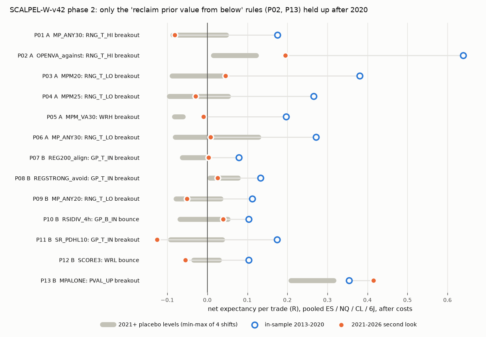

# REPORT_P2 - SCALPEL-W-v42 phase 2: context, confluence and market profile

Follow-up to [REPORT.md](REPORT.md). The question: do the weekly v42 levels work when a signal is taken only
with supporting evidence - trend regime, prior-week market profile (POC / value area), RSI divergence,
basic support / resistance - rather than on every touch? Same process as phase 1: full pierce grid under
each filter, the same filter on four placebo level sets, the family screen, EXPAND / REFINE rounds until
two rounds bring no new passing family, then frozen finalists, leave-one-ticker-out and holdouts.
Status tags: all numbers are **[NEW]** unless marked.

## 1. Verdict

**No rule passes every gate. [NEW]** The context filters named for the system do not turn the v42 levels
into an edge. Each was tested as a filter over the whole grid against placebo levels. The best rule for
each was frozen and tested on 2021-2026, and none held up there: uptrend, bear-market avoidance, RSI
divergence, prior-week POC, basic S/R, stacked evidence (Section 5).

Across the 56 phase 2 families, the real v42 levels rank first of five searches (real + four placebo
shifts) in 23% of families on top-10 expectancy and 21% on screen passers, where chance is
20% (p = 0.32 and 0.45). Phase 1 was lower. Context does not make the v42 levels look
different from nearby arbitrary lines.

The in-sample favourite was a v42 level lying near prior value (0.20-0.30 sigma of the prior week's or
month's POC / VAH / VAL), traded as a long breakout. It passed the family screen across a whole range of
tolerances, which no phase 1 idea did. Out of sample it went flat or negative (P01, P03-P06, P09).

**One idea held up in 2021-2026, and the best version of it does not use v42 at all.** When the week
opens below the prior week's value area low, go long on a 4h close back above that VAL, with a stop
0.5 sigma below it, and hold to Friday (P13).
* In-sample: 0.354 R per trade [95% CI 0.15, 0.56], n = 122.
* 2021-2026: 0.415 R [0.14, 0.71], n = 84, PF 2.21. That beats all four placebo
  level sets (max 0.315), and 2022 was positive.
* The v42 version (P02) uses the RNG_T_HI breakout in weeks that open below prior value. It is weaker:
  0.195 R [-0.08, 0.48], losing in 2022-2023.

P13 is still **not proven by the prompt's standard**. It has 84 trades from 2021 on (fewer than 100). Its
in-sample per-trade Sharpe (0.31) clears only the lenient deflation floor (0.27), not the strict
ones. The only clean holdout, GC, gives it 5 trades under the $500 sizing rule (9 with at
least one micro), at 0.26 R. There the placebo levels did better (0.76 R), though that is far
too few trades to mean anything either way. Its short mirror (sell a close back below the prior VAH in a week that
opened above it) loses in-sample: PF 0.55, and every neighbouring config is negative. So the
effect is buying-side only.

What this means for the mission: whatever edge the people trading this system have is more likely in
the market profile they trade alongside than in the v42 levels. P13 is the one lead worth
forward-testing, and it needs fresh data before anyone trades it.

## 2. What was added

`src/features.py` builds every feature with no look-ahead (week-level values from the prior day, and
bar-level gates from the close before the entry bar):
* **Regime:** daily SMA50 / SMA200, strong bull or bear (price vs a rising or falling SMA200),
  drawdown from the 52-week high.
* **Market profile:** a TPO proxy built from the 4h bars. Each bar spreads its time over its range in
  0.02-sigma bins; POC plus a 70% value area are computed for the prior week, the prior two weeks, a
  4-week composite and the prior month. The developing weekly POC and TPO density (a thin/thick-node
  proxy) are also available. The exports have no volume, so this is time-at-price, not a volume profile.
* **RSI(14) divergence** on 4h and daily bars, using 2-bar confirmed pivots.
* **S/R:** prior-day high / low, daily swing pivots, prior-week high / low.

Families (`src/families_p2.py`): 64 variants in 5 rounds. Each is the full 229,068-config grid (MPALONE:
its own 1,416 cells) on the real levels and on four placebo shifts. Coverage is 100%, with 0 errors
(`coverage_summary.csv`).

## 3. Family results

| round | variant | real passers | placebo passers mean / max | real top-10 expR | placebo top-10 mean / max | beats placebo (count, top-10) | family screen |
|---|---|---|---|---|---|---|---|
| P2-1 | REG200_align | 139 | 419 / 487 | 0.323 | 0.443 / 0.510 | 0/4, 0/4 | fail (b) |
| P2-1 | REG5020_align | 938 | 1327 / 1381 | 0.502 | 0.598 / 0.644 | 0/4, 0/4 | fail (b) |
| P2-1 | REGSTRONG_avoid | 826 | 1210 / 1322 | 0.458 | 0.407 / 0.461 | 0/4, 3/4 | fail (b) |
| P2-1 | BEAR20_avoid | 1112 | 1628 / 1894 | 0.479 | 0.403 / 0.448 | 0/4, 4/4 | fail (b) |
| P2-1 | MP_POC10 | 0 | 19 / 57 | 0.208 | 0.318 / 0.426 | 0/4, 0/4 | fail (a) |
| P2-1 | MP_VA10 | 117 | 446 / 1093 | 0.474 | 0.354 / 0.377 | 2/4, 3/4 | fail (b) |
| P2-1 | MP_ANY20 | 817 | 664 / 1133 | 0.572 | 0.529 / 0.617 | 3/4, 3/4 | PASS |
| P2-1 | OPENVA_with | 123 | 114 / 256 | 0.321 | 0.291 / 0.454 | 2/4, 3/4 | fail (b) |
| P2-1 | OPENVA_in | 82 | 328 / 570 | 0.305 | 0.317 / 0.327 | 0/4, 1/4 | fail (b) |
| P2-1 | OPENVA_against | 1915 | 1446 / 2169 | 0.858 | 0.752 / 0.830 | 3/4, 4/4 | PASS |
| P2-1 | RSIDIV_4h | 117 | 216 / 525 | 0.400 | 0.473 / 0.566 | 2/4, 1/4 | fail (b) |
| P2-1 | RSIDIV_D | 0 | 0 / 0 | 0.132 | 0.051 / 0.185 | 0/4, 3/4 | fail (a) |
| P2-1 | SR_PDHL10 | 481 | 1157 / 2173 | 0.348 | 0.440 / 0.463 | 0/4, 0/4 | fail (b) |
| P2-1 | SR_SWING10 | 402 | 578 / 1074 | 0.424 | 0.376 / 0.601 | 1/4, 3/4 | fail (b) |
| P2-1 | SCORE2 | 426 | 710 / 991 | 0.370 | 0.365 / 0.392 | 0/4, 2/4 | fail (b) |
| P2-1 | SCORE3 | 113 | 200 / 411 | 0.208 | 0.315 / 0.496 | 2/4, 0/4 | fail (b) |
| P2-1 | TGT_POC | 166 | 80 / 156 | 0.383 | 0.382 / 0.450 | 4/4, 3/4 | PASS |
| P2-1 | MPALONE | 341 | 354 / 451 | 0.587 | 0.445 / 0.598 | 2/4, 3/4 | fail (b) |
| P2-2 | OVA_ag_poc | 2663 | 2971 / 3623 | 0.699 | 0.578 / 0.616 | 1/4, 4/4 | fail (b) |
| P2-2 | OVA_ag_far | 1194 | 1011 / 1764 | 0.806 | 0.735 / 0.833 | 2/4, 3/4 | fail (b) |
| P2-2 | OVA_ag_pwl | 0 | 0 / 0 | - | - / - | 0/4, 0/4 | fail (a) |
| P2-2 | MP_ANY15 | 309 | 535 / 945 | 0.624 | 0.549 / 0.633 | 1/4, 2/4 | fail (b) |
| P2-2 | MP_ANY30 | 1539 | 989 / 1134 | 0.680 | 0.570 / 0.647 | 4/4, 4/4 | PASS |
| P2-2 | MP_POC20 | 78 | 115 / 250 | 0.375 | 0.394 / 0.505 | 2/4, 1/4 | fail (b) |
| P2-2 | MP_VA20 | 598 | 534 / 1032 | 0.554 | 0.551 / 0.684 | 3/4, 3/4 | PASS |
| P2-2 | TGT_VA | 284 | 161 / 240 | 0.428 | 0.422 / 0.479 | 4/4, 3/4 | PASS |
| P2-2 | TGT_POC_naked | 277 | 344 / 606 | 0.340 | 0.425 / 0.467 | 2/4, 0/4 | fail (b) |
| P2-2 | MP80 | 742 | 508 / 642 | 0.464 | 0.497 / 0.530 | 4/4, 0/4 | fail (b) |
| P2-2 | MP4W20 | 1315 | 761 / 1943 | 0.572 | 0.611 / 0.681 | 3/4, 1/4 | fail (b) |
| P2-2 | REG200_MP20 | 63 | 147 / 212 | 0.269 | 0.255 / 0.417 | 1/4, 1/4 | fail (b) |
| P2-2 | RSI_EXT | 11 | 80 / 172 | 0.249 | 0.300 / 0.418 | 0/4, 1/4 | fail (b) |
| P2-2 | TREND_D20 | 397 | 570 / 997 | 0.304 | 0.322 / 0.419 | 1/4, 2/4 | fail (b) |
| P2-3 | MP_ANY25 | 1147 | 854 / 1149 | 0.679 | 0.581 / 0.632 | 3/4, 4/4 | PASS |
| P2-3 | MP_ANY40 | 1473 | 1200 / 1870 | 0.651 | 0.684 / 0.825 | 3/4, 2/4 | fail (b) |
| P2-3 | MP_ANY50 | 1430 | 1444 / 2394 | 0.621 | 0.741 / 0.922 | 3/4, 1/4 | fail (b) |
| P2-3 | MP_VA30 | 1291 | 809 / 1018 | 0.729 | 0.605 / 0.674 | 4/4, 4/4 | PASS |
| P2-3 | MP_VA40 | 1664 | 1137 / 1782 | 0.670 | 0.706 / 0.821 | 3/4, 1/4 | fail (b) |
| P2-3 | MP30_TGT_VA | 57 | 48 / 77 | 0.157 | 0.172 / 0.193 | 2/4, 1/4 | fail (b) |
| P2-3 | MP_IN_VA | 387 | 768 / 1200 | 0.479 | 0.502 / 0.581 | 1/4, 1/4 | fail (b) |
| P2-3 | MP_OUT_VA | 328 | 355 / 846 | 0.404 | 0.458 / 0.523 | 3/4, 0/4 | fail (b) |
| P2-3 | LVN | 468 | 604 / 997 | 0.468 | 0.451 / 0.589 | 2/4, 3/4 | fail (b) |
| P2-3 | HVN | 0 | 24 / 76 | - | 0.383 / 0.385 | 0/4, 0/4 | fail (a) |
| P2-3 | MPM20 | 1166 | 860 / 1436 | 0.877 | 0.661 / 0.771 | 3/4, 4/4 | PASS |
| P2-4 | VAMIG_with | 927 | 1129 / 1778 | 0.266 | 0.405 / 0.469 | 2/4, 0/4 | fail (b) |
| P2-4 | VAMIG_against | 623 | 758 / 952 | 0.444 | 0.520 / 0.611 | 0/4, 1/4 | fail (b) |
| P2-4 | BALANCE | 69 | 94 / 207 | 0.277 | 0.282 / 0.325 | 2/4, 2/4 | fail (b) |
| P2-4 | TRENDWK | 1983 | 2849 / 3374 | 0.573 | 0.489 / 0.507 | 0/4, 4/4 | fail (b) |
| P2-4 | DEVPOC_below | 390 | 182 / 220 | 0.396 | 0.398 / 0.414 | 4/4, 2/4 | fail (b) |
| P2-4 | DEVPOC_above | 466 | 769 / 1103 | 0.508 | 0.548 / 0.644 | 0/4, 1/4 | fail (b) |
| P2-4 | MPM15 | 797 | 610 / 958 | 0.390 | 0.558 / 0.693 | 2/4, 1/4 | fail (b) |
| P2-4 | MPM30 | 1742 | 1172 / 1675 | 0.870 | 0.604 / 0.712 | 4/4, 4/4 | PASS |
| P2-4 | MPM_POC20 | 44 | 160 / 414 | 0.595 | 0.526 / 0.575 | 2/4, 2/4 | fail (b) |
| P2-4 | MP_VAH30 | 489 | 218 / 367 | 0.595 | 0.452 / 0.602 | 4/4, 3/4 | PASS |
| P2-4 | MP_VAL30 | 163 | 182 / 316 | 0.455 | 0.373 / 0.458 | 2/4, 3/4 | fail (b) |
| P2-4 | MPWM20 | 49 | 46 / 150 | 0.183 | 0.295 / 0.529 | 3/4, 1/4 | fail (b) |
| P2-5 | ACCEPT_VA | 125 | 180 / 399 | 0.334 | 0.330 / 0.389 | 2/4, 2/4 | fail (b) |
| P2-5 | OPENIN_VA30 | 121 | 185 / 339 | 0.324 | 0.289 / 0.382 | 1/4, 2/4 | fail (b) |
| P2-5 | PCLOSE_Q | 626 | 488 / 737 | 0.302 | 0.387 / 0.476 | 3/4, 0/4 | fail (b) |
| P2-5 | POC2W25 | 580 | 795 / 1392 | 0.544 | 0.522 / 0.558 | 1/4, 2/4 | fail (b) |
| P2-5 | PWHL30 | 312 | 292 / 610 | 0.430 | 0.337 / 0.375 | 2/4, 4/4 | fail (b) |
| P2-5 | MPM25 | 1626 | 1069 / 1517 | 0.879 | 0.633 / 0.766 | 4/4, 4/4 | PASS |
| P2-5 | MPM_VA30 | 1125 | 747 / 1071 | 0.844 | 0.543 / 0.628 | 4/4, 4/4 | PASS |
| P2-5 | MP_VAH20 | 53 | 215 / 507 | 0.297 | 0.347 / 0.450 | 1/4, 1/4 | fail (b) |
| P2-5 | MP_VAH40 | 788 | 302 / 581 | 0.632 | 0.505 / 0.600 | 4/4, 4/4 | PASS |

Rounds 4 and 5 produced no new family that passed; their passes were refinements of the
profile-confluence region. That meets the stop rule.

## 4. Do the v42 levels beat nearby lines anywhere? (meta-test over every family)

| searches | metric | families | real ranked 1st of 5 | share (chance = 0.20) | p (more often than chance) | mean rank (chance = 3.0) | p (better than chance) |
|---|---|---|---|---|---|---|---|
| phase 1 | top-10 expectancy | 34 | 4 | 0.12 | 0.93 | 2.85 | 0.27 |
| phase 1 | screen passers | 34 | 0 | 0.00 | 1.00 | 3.65 | 1.00 |
| phase 2 | top-10 expectancy | 56 | 13 | 0.23 | 0.32 | 2.84 | 0.20 |
| phase 2 | screen passers | 56 | 12 | 0.21 | 0.45 | 2.95 | 0.39 |
| all | top-10 expectancy | 90 | 17 | 0.19 | 0.65 | 2.84 | 0.15 |
| all | screen passers | 90 | 12 | 0.13 | 0.96 | 3.21 | 0.92 |

## 5. Frozen finalists and gates

Frozen in commit `c3a4f31` (`FREEZE_P2.md`, `finalists_p2.csv`) from 2013-2020 only. Tier A is the six
best entry clusters from families that passed the screen; tier B is the best rule for each idea you
named, plus the market-profile levels alone. 2021+ is a **second look**: it was opened once in phase 1,
so it is weaker evidence than a first opening, although no phase 2 rule was chosen with it. GC
(COMEX:GC1! 4h, 2023-07 to 2026-09) was sealed on disk before phase 2 began and read once. G1-G7 are as
in phase 1, applied to 2021+. G8 needs >= 20 GC trades, a positive expectancy in R and $, and a result
above the placebo mean. DSR floors: 3.23 (N = 27,160,308), 2.21 (N_eff = 6,761), and
0.27 for the lenient null-variance version with N_eff.

| id | tier | variant: config | IS n / PF / expR | 2021+ n / PF / expR | 2021+ placebo mean / max | LOTO | G1 | G3 2x slip | G4 x0.95/x1.05 | G5 placebo | G6 DSR | G7 | GC n / expR (placebo mean) | G8 GC | failed |
|---|---|---|---|---|---|---|---|---|---|---|---|---|---|---|---|
| P01 | A | MP_ANY30: `RNG_T_HI|breakout|SIG|d0.10|b_reclaim|Dinf|s0.50|t0.25` | 129 / 2.40 / 0.175 | 121 / 0.71 / -0.082 | -0.009 / 0.047 | 4/4 | **fail** | **fail** | -0.052 / -0.046 **fail** | **fail** | **fail** | needs 15m | 2 / 0.482 (-0.070) | **fail** | G1 OOS2, G3 2x slip, G4 x0.95/x1.05, G5 placebo, G6 DSR, G8 GC holdout, G7 path (needs 15m) |
| P02 | A | OPENVA_against: `RNG_T_HI|breakout|SIG|d0.10|b_reclaim|Dinf|s0.25|t1.00` | 100 / 2.96 / 0.639 | 103 / 1.43 / 0.195 | 0.050 / 0.122 | 4/4 | pass | pass | 0.052 / 0.140 pass | pass | **fail** | needs 15m | 3 / 2.386 (0.214) | **fail** | G6 DSR, G8 GC holdout, G7 path (needs 15m) |
| P03 | A | MPM20: `RNG_T_LO|breakout|ATR|d0.00|c3|Dinf|s0.75|t2.00` | 133 / 2.35 / 0.381 | 94 / 1.02 / 0.045 | -0.045 / 0.042 | 4/4 | **fail** | pass | 0.112 / 0.126 pass | pass | **fail** | ok | 8 / 0.002 (0.413) | **fail** | G1 OOS2, G6 DSR, G8 GC holdout |
| P04 | A | MPM25: `RNG_T_LO|breakout|ATR|d0.25|b_reclaim|Dinf|s1.00|t1.50` | 135 / 2.37 / 0.265 | 90 / 0.95 / -0.030 | -0.044 / 0.052 | 4/4 | **fail** | **fail** | -0.019 / -0.050 **fail** | pass | **fail** | needs 15m | 5 / 0.110 (0.338) | **fail** | G1 OOS2, G3 2x slip, G4 x0.95/x1.05, G6 DSR, G8 GC holdout, G7 path (needs 15m) |
| P05 | A | MPM_VA30: `WRH|breakout|ATR|d0.00|c3|Dinf|s1.00|t0.75` | 116 / 2.38 / 0.197 | 75 / 0.91 / -0.010 | -0.069 / -0.060 | 4/4 | **fail** | **fail** | 0.006 / 0.055 pass | pass | **fail** | ok | 4 / 0.062 (0.241) | **fail** | G1 OOS2, G3 2x slip, G6 DSR, G8 GC holdout |
| P06 | A | MP_ANY30: `RNG_T_LO|breakout|ATR|d0.00|c3|Dinf|s0.75|t2.00` | 225 / 1.89 / 0.271 | 180 / 0.94 / 0.008 | 0.005 / 0.128 | 3/4 | **fail** | **fail** | 0.028 / 0.054 pass | pass | **fail** | ok | 7 / 0.342 (0.366) | **fail** | G1 OOS2, G3 2x slip, G6 DSR, G8 GC holdout |
| P07 | B | REG200_align: `GP_T_IN|breakout|ATR|d0.25|b_reclaim|Dinf|s1.00|t0.75` | 358 / 1.37 / 0.079 | 210 / 0.96 / 0.003 | -0.035 / -0.001 | 2/4 | **fail** | pass | -0.007 / 0.009 **fail** | pass | **fail** | needs 15m | 20 / -0.086 (0.086) | **fail** | G1 OOS2, G2 LOTO, G4 x0.95/x1.05, G6 DSR, G8 GC holdout, G7 path (needs 15m) |
| P08 | B | REGSTRONG_avoid: `GP_T_IN|breakout|ATR|d0.25|b_reclaim|Dinf|s1.00|t2.00` | 410 / 1.54 / 0.133 | 235 / 1.05 / 0.025 | 0.030 / 0.077 | 1/4 | **fail** | pass | 0.006 / 0.042 pass | **fail** | **fail** | needs 15m | 19 / -0.109 (0.100) | **fail** | G1 OOS2, G2 LOTO, G5 placebo, G6 DSR, G8 GC holdout, G7 path (needs 15m) |
| P09 | B | MP_ANY20: `RNG_T_LO|breakout|SIG|d0.25|b_reclaim|Dinf|s0.75|t0.25` | 116 / 2.26 / 0.112 | 88 / 0.71 / -0.051 | -0.010 / 0.034 | 4/4 | **fail** | **fail** | -0.053 / -0.046 **fail** | **fail** | **fail** | ok | 0 / - (-0.306) | **fail** | G1 OOS2, G3 2x slip, G4 x0.95/x1.05, G5 placebo, G6 DSR, G8 GC holdout |
| P10 | B | RSIDIV_4h: `GP_B_IN|bounce|SIG|d0.10|c3|D1.5|s0.40|t0.25` | 102 / 1.60 / 0.103 | 54 / 1.21 / 0.040 | -0.032 / 0.051 | 0/4 | **fail** | pass | -0.025 / -0.013 **fail** | pass | **fail** | needs 15m | 2 / -1.011 (0.257) | **fail** | G1 OOS2, G2 LOTO, G4 x0.95/x1.05, G6 DSR, G8 GC holdout, G7 path (needs 15m) |
| P11 | B | SR_PDHL10: `GP_T_IN|breakout|ATR|d0.40|b_reclaim|Dinf|s0.75|t0.75` | 189 / 1.85 / 0.174 | 132 / 0.67 / -0.125 | -0.029 / 0.038 | 4/4 | **fail** | **fail** | -0.110 / -0.134 **fail** | **fail** | **fail** | ok | 15 / 0.137 (-0.158) | **fail** | G1 OOS2, G3 2x slip, G4 x0.95/x1.05, G5 placebo, G6 DSR, G8 GC holdout |
| P12 | B | SCORE3: `WRL|bounce|ATR|d0.00|b_reclaim|D1.5|s1.00|NEXT` | 141 / 1.77 / 0.104 | 104 / 0.71 / -0.055 | -0.002 / 0.030 | 3/4 | **fail** | **fail** | -0.039 / -0.005 **fail** | **fail** | **fail** | ok | 15 / 0.248 (-0.169) | **fail** | G1 OOS2, G3 2x slip, G4 x0.95/x1.05, G5 placebo, G6 DSR, G8 GC holdout |
| P13 | B | MPALONE: `PVAL_UP|breakout|SIG|d0.00|c1|Dinf|s0.50|t2.00` | 122 / 2.02 / 0.354 | 84 / 2.21 / 0.415 | 0.242 / 0.315 | 4/4 | **fail** | pass | n/a pass | pass | **fail** | ok | 5 / 0.262 (0.759) | **fail** | G1 OOS2, G6 DSR, G8 GC holdout |

The ideas you named, answered directly:

| idea | finalist | IS n / PF / expR | 2021+ n / PF / expR | GC n / expR (min-one: n / expR) | LOTO | failed gates |
|---|---|---|---|---|---|---|
| generalized uptrend (longs only above the 200-day SMA) | P07 | 358 / 1.37 / 0.079 | 210 / 0.96 / 0.003 | 20 / -0.086 (58 / 0.066) | 2/4 | G1 OOS2, G2 LOTO, G4 x0.95/x1.05, G6 DSR, G8 GC holdout, G7 path (needs 15m) |
| avoid bullish setups in a strong bear market | P08 | 410 / 1.54 / 0.133 | 235 / 1.05 / 0.025 | 19 / -0.109 (61 / 0.049) | 1/4 | G1 OOS2, G2 LOTO, G5 placebo, G6 DSR, G8 GC holdout, G7 path (needs 15m) |
| prior-week POC / value confluence (0.20 sigma) | P09 | 116 / 2.26 / 0.112 | 88 / 0.71 / -0.051 | 0 / - (8 / 0.266) | 4/4 | G1 OOS2, G3 2x slip, G4 x0.95/x1.05, G5 placebo, G6 DSR, G8 GC holdout |
| bullish / bearish RSI divergence (4h) | P10 | 102 / 1.60 / 0.103 | 54 / 1.21 / 0.040 | 2 / -1.011 (7 / -0.214) | 0/4 | G1 OOS2, G2 LOTO, G4 x0.95/x1.05, G6 DSR, G8 GC holdout, G7 path (needs 15m) |
| basic S/R (prior-day high / low) | P11 | 189 / 1.85 / 0.174 | 132 / 0.67 / -0.125 | 15 / 0.137 (21 / 0.114) | 4/4 | G1 OOS2, G3 2x slip, G4 x0.95/x1.05, G5 placebo, G6 DSR, G8 GC holdout |
| stacked evidence (3 of 5 signals) | P12 | 141 / 1.77 / 0.104 | 104 / 0.71 / -0.055 | 15 / 0.248 (30 / 0.074) | 3/4 | G1 OOS2, G3 2x slip, G4 x0.95/x1.05, G5 placebo, G6 DSR, G8 GC holdout |
| market-profile levels alone, no v42 | P13 | 122 / 2.02 / 0.354 | 84 / 2.21 / 0.415 | 5 / 0.262 (9 / 0.538) | 4/4 | G1 OOS2, G6 DSR, G8 GC holdout |

## 6. The lead: reclaim of prior value from below

**P13 (market profile only)**, `PVAL_UP|breakout|SIG|d0.00|c1|Dinf|s0.50|t2.00` on the prior-week value area low (VAL). The rule applies in
weeks whose open is at least 0.05 sigma below the prior VAL. After the first 4h bar trades above the
VAL, a 4h close above it (on that bar or the next) triggers a market buy at the next bar's open. The
stop is VAL - 0.50 sigma. The target is entry + 2.0 sigma, which is rarely reached, so most trades exit
at the week's final 4h close. sigma = WO x vol / sqrt(52), with the pine per-asset vol. Size: $500 /
planned stop distance, in micros.

| period | ticker | n | WR | PF | net expR | net $ | max DD $ |
|---|---|---|---|---|---|---|---|
| IS | ES | 37 | 0.62 | 2.10 | 0.377 | 5,865 | 2,442 |
| IS | NQ | 41 | 0.56 | 1.75 | 0.360 | 4,936 | 1,554 |
| IS | CL | 30 | 0.60 | 2.27 | 0.355 | 4,306 | 1,092 |
| IS | 6J | 14 | 0.71 | 2.39 | 0.269 | 1,743 | 441 |
| IS | POOLED | 122 | 0.61 | 2.02 | 0.354 | 16,849 | 3,390 |
| OOS2 | ES | 27 | 0.59 | 3.15 | 0.670 | 6,343 | 944 |
| OOS2 | NQ | 7 | 0.57 | 3.02 | 0.935 | 2,671 | 920 |
| OOS2 | CL | 25 | 0.60 | 2.55 | 0.459 | 4,833 | 894 |
| OOS2 | 6J | 25 | 0.40 | 0.88 | -0.050 | -443 | 2,146 |
| OOS2 | POOLED | 84 | 0.54 | 2.21 | 0.415 | 13,404 | 2,594 |
| GC_HOLDOUT | GC | 5 | 0.60 | 2.86 | 0.262 | 550 | 296 |

| period | year | n | WR | net expR | net $ |
|---|---|---|---|---|---|
| GC_HOLDOUT | 2023 | 2 | 0.50 | +0.317 | 206 |
| GC_HOLDOUT | 2024 | 1 | 0.00 | -0.434 | -195 |
| GC_HOLDOUT | 2025 | 2 | 1.00 | +0.556 | 539 |
| IS | 2013 | 12 | 0.50 | +0.108 | 564 |
| IS | 2014 | 4 | 0.25 | -0.361 | -637 |
| IS | 2015 | 20 | 0.65 | +0.240 | 1,933 |
| IS | 2016 | 19 | 0.42 | -0.079 | -1,180 |
| IS | 2017 | 14 | 0.57 | +0.286 | 1,921 |
| IS | 2018 | 13 | 0.69 | +0.688 | 3,299 |
| IS | 2019 | 14 | 0.79 | +0.423 | 2,433 |
| IS | 2020 | 26 | 0.69 | +0.812 | 8,516 |
| OOS2 | 2021 | 18 | 0.72 | +0.798 | 5,579 |
| OOS2 | 2022 | 16 | 0.38 | +0.557 | 3,037 |
| OOS2 | 2023 | 11 | 0.27 | -0.161 | -1,153 |
| OOS2 | 2024 | 14 | 0.57 | +0.333 | 1,886 |
| OOS2 | 2025 | 17 | 0.59 | +0.399 | 3,167 |
| OOS2 | 2026 | 8 | 0.62 | +0.240 | 888 |

In-sample neighbourhood (stop, target and entry-timing variants of the same trigger): 69% of
147 configs are positive, median +0.159 R. The short mirror's neighbourhood: 0% positive,
median -0.153 R. GC holdout: 5 trades, 0.262 R under the sizing rule; with at least one micro,
9 trades, 0.538 R.

**P02 (the v42 version)**, `RNG_T_HI|breakout|SIG|d0.10|b_reclaim|Dinf|s0.25|t1.00` in weeks that open below the prior VAL: the long breakout
through RNG_T_HI (WRH + 0.078 sigma). It passed G1 to G5 on 2021+, with PF 1.43 and 0.195 R above a placebo max
of 0.122. It failed G6 and G8 (GC 3 trades), and it needs 15m path resolution (pierce 0.10 sigma).
Its round-2 refinements (open below POC, open far below value) did not pass in-sample, and 6J lost in
2021+.

| period | ticker | n | WR | PF | net expR | net $ | max DD $ |
|---|---|---|---|---|---|---|---|
| IS | ES | 27 | 0.67 | 3.60 | 0.737 | 9,293 | 1,328 |
| IS | NQ | 32 | 0.50 | 2.38 | 0.466 | 7,042 | 1,010 |
| IS | CL | 31 | 0.55 | 2.68 | 0.690 | 10,107 | 994 |
| IS | 6J | 10 | 0.70 | 6.58 | 0.769 | 3,688 | 541 |
| IS | POOLED | 100 | 0.58 | 2.96 | 0.639 | 30,130 | 2,058 |
| OOS2 | ES | 35 | 0.49 | 2.00 | 0.385 | 5,901 | 1,322 |
| OOS2 | NQ | 29 | 0.48 | 1.88 | 0.321 | 4,206 | 1,566 |
| OOS2 | CL | 21 | 0.43 | 1.38 | 0.147 | 1,529 | 1,992 |
| OOS2 | 6J | 18 | 0.28 | 0.49 | -0.323 | -2,892 | 4,990 |
| OOS2 | POOLED | 103 | 0.44 | 1.43 | 0.195 | 8,744 | 4,744 |
| GC_HOLDOUT | GC | 3 | 1.00 | inf | 2.386 | 2,954 | 0 |

## 7. Integrity notes

* The first `evaluate` run crashed on a code error before writing or printing any result (an empty
  trade frame when every trade in a set is skipped by the $500 budget). The note and fix were committed
  before the single re-run (`1408579`). No rule, gate or selection changed. A secondary "min-one-micro"
  row was declared before the re-run as an edge check, because one MGC or MNQ often risks more than $500.
* 2021+ is a second look (see Section 5). GC is the clean holdout, but it covers only 3.2 years, and the
  sizing rule leaves most rules with fewer than 20 trades.
* The market profile is a 4h TPO proxy with no volume. A true volume profile or 30-minute TPO could
  place POC and value differently.
* N now counts 22,808,016 unique configs plus the phase 1 pre-fix run. N_eff is 6,761 entry-overlap clusters.

## 8. What would settle it

1. Freeze P13 and P02 as they are, and test them once on data neither phase has touched. Full-history
   TradingView 4h exports of the other calibrated tickers (YM, RTY, SI, 6E, ZN, and GC back to 2013)
   would give several hundred more trades.
2. Re-export with volume, so the value area can be built from a volume profile instead of the TPO
   proxy.
3. Paper-trade P13 forward, logging each week's prior VAL and the reclaim bar.
